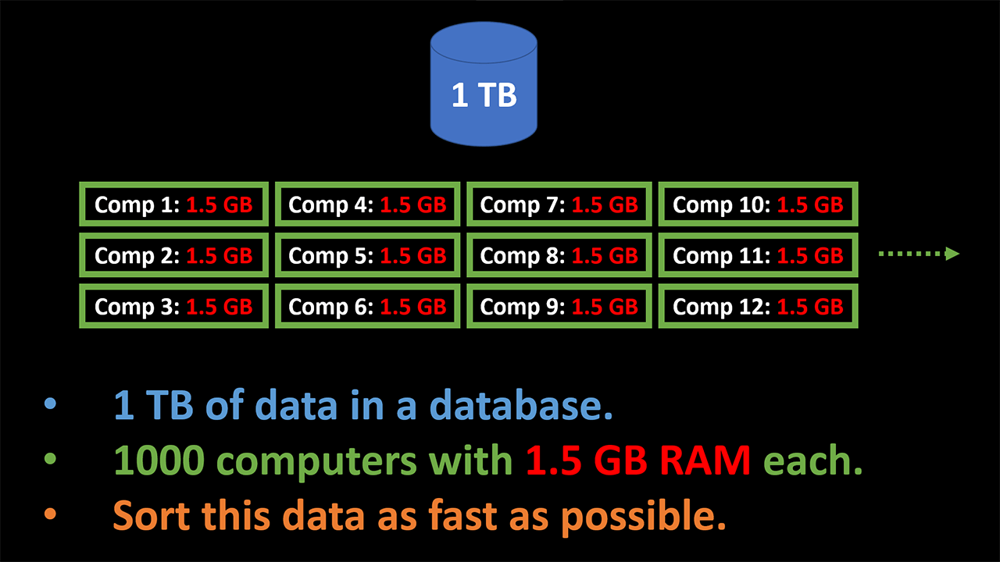

# Distributed Sorting - Google Interview Question - Algorithm and System Design - Full 2 Hour Interview Walkthrough
If you were given 1 TB of data and asked to sort it using 1000 computers, how would you do it. This is a Google senior interview question, and below is a summary of the optimum solution. In this article, we will do the full 2-hour interview stages together and get hired!

<video width="1920" height="1080" controls><source src="media/intro.mp4" type="video/mp4"></video>

First off, let's check out the agenda for this writeup. We will start by visualizing the problem. Then we will continue with a concise design document. This is probably going to be on a whiteboard in a real interview, so we will keep it short. In the document, we will define the problem, do requirements analysis, do system design using a simple diagram, and finally do the complexity analysis. Then we will actually code and implement this system. Then we'll add some tests. And we will close it off with a discussion with the interviewers.

I will take you through the entire 2-hour interview in sections and do every section with an in-depth analysis. You are about to read the most in-depth late-stage senior interview analysis on the internet. So, sit back, relax, and turn up your brain to the max.

Table of contents:
* [Resources](#resources)
* [Overview](#overview)
* [Problem Visualization](#problem-visualization)
* [Design Document](#design-document)
  * [Problem Definition](#problem-definition)
  * [Requirements Analysis](#requirements-analysis)
  * [System Design](#system-design)
  * [Complexity Analysis](#complexity-analysis)
* [Implementation](#implementation)
* [Tests](#tests)
* [Discussion](#discussion)
* [Conclusion](#conclusion)

## Resources
You can find the video version of this article on YouTube: [https://www.youtube.com/watch?v=vgKjatRVtys](https://www.youtube.com/watch?v=vgKjatRVtys){:target="_blank"}{:rel="noopener"}

<iframe width="560" height="315" src="https://www.youtube.com/embed/vgKjatRVtys" frameborder="0" allow="accelerometer; autoplay; encrypted-media; gyroscope; picture-in-picture" allowfullscreen></iframe>

The video is fully animated. If you want to read the comments or leave a comment, do so under the YouTube video. If you want to contribute to the article, make a pull request on GitHub.

My simplified distributed sorting algorithm implementation:
* [https://github.com/soygul/QuanticDev/blob/master/algorithms/distributed-computing/distributed-sorting/distributed-sorting.js](https://github.com/soygul/QuanticDev/blob/master/algorithms/distributed-computing/distributed-sorting/distributed-sorting.js){:target="_blank"}{:rel="noopener"}

My k-way merge and tournament tree implementations and their tests:
* [https://github.com/soygul/QuanticDev/tree/master/algorithms/merge](https://github.com/soygul/QuanticDev/tree/master/algorithms/merge){:target="_blank"}{:rel="noopener"}
* [https://github.com/soygul/QuanticDev/tree/master/algorithms/trees/tournament-tree](https://github.com/soygul/QuanticDev/tree/master/algorithms/trees/tournament-tree){:target="_blank"}{:rel="noopener"}

Chromium Project Design Document Template:
* [https://docs.google.com/document/d/14YBYKgk-uSfjfwpKFlp_omgUq5hwMVazy_M965s_1KA/edit](https://docs.google.com/document/d/14YBYKgk-uSfjfwpKFlp_omgUq5hwMVazy_M965s_1KA/edit){:target="_blank"}{:rel="noopener"}

My [K-Way Merge](https://www.youtube.com/watch?v=Xo54nlPHSpg){:target="_blank"}{:rel="noopener"} video, which explains k-way merge which is used extensively in this video.

My [Software Engineering Compensation Guide](/articles/software-engineer-compensation-guide){:target="_blank"}{:rel="noopener"} article to help you estimate what you should be paid:

## Overview
Let's check out the problem in hand. In this question, you are given 1 TB of data sitting in a database, and 1000 computers each with 1.5 GB of RAM. And you are asked to sort this data as fast as possible.

This is a distributed sorting question asked by Google in a senior engineer interview. This was asked during the final interview round, and it is a hard question. In addition to the question being hard, the discussion held with the interviewer around other possible solutions, possible improvements, and external factors that might affect the performance, will test your deeper understanding of the topic. The source of this question is Hacker News, and you can find several versions of this question being discussed by ex-Googlers on HN. Obviously, I cannot reveal the source directly, but I am keeping a record of these questions as I find them to see how frequently they are asked. Distributed computing questions seem very frequent at senior Google interviews. On a side note, the original question was asked to be implemented using Python or C++ on a Kubernetes cluster. Finally, 2 hours is allocated for this interview, including design, implementation, and discussion. We will look into multiple approaches to solve this problem and investigate different requirements along with other variants that you might be given in an interview situation.

## Problem Visualization
Let's start by visualizing the problem. When I am given a question, the first thing I do is to try to visualize it in my mind to investigate possible solutions quickly. I do this before jumping into the requirements analysis and start asking questions. If I am given a whiteboard, I will try to visualize the problem drawing a matrix, a diagram, or whatever might help me imagine possible solutions.

For this video, I will visualize this question using an animated diagram to help you understand it better. We start with our 1 TB of data in our database. Then comes our 1000 computers with 1.5 GB of RAM each. Let's say we make each computer read 1 GB portion of our data from our database. Now we are left with 1000 nodes with all our data in them.

Next, what do we do with this much data and this many nodes? How do we utilize the CPU power of all the nodes at the same time? We can try to make all nodes sort the data that they have in them. Remember, they all have 1.5 GB of RAM, and we have only used 1 GB of it. This gives us 500 MB of auxiliary space to work with. Heapsort only requires O(1) auxiliary space, so it is perfect for this job. Quicksort also only requires O(logn) auxiliary space, so we might use that too. We can decide this in the design phase.

Once each node finishes sorting their data simultaneously, how do we merge them? Well, there is a method called k-way merge designed exactly for this purpose. We can definitely use that! It is possible to implement k-way (also known as multiway) merge using a heap, or even better, using tournament trees. We start by selecting one of the nodes as the leader, the leader pulls the first values from each other node and puts them in a tournament tree. The root of the tree will be our first winner and the very first sorted value. Then we pull a new value in place of the missing value, complete our tournament tree and get the root again. We can keep doing this to get a sorted stream of data and write it back to our database into another table. This seems like a very workable approach. But will it match the requirements? We will have to discover that by asking lots of questions to the interviewers. But this is a good visualization and good initial approach which should hopefully help us come up with lots of good questions in the requirements analysis phase.

## Design Document
In a regular coding interview, I would directly jump to the requirements analysis to select the best algorithm for the question in hand. However, this is the final interview stage with 2 hours to go. This is where you show off with your software engineering skills. So, we treat this as a serious project and start with a design document. Typically, design documents are very long and detailed. A well-crafted design increases the odds of success of a project. However, for this occasion, we will keep it short. Short enough to fit into a single whiteboard, or a single page if you are given paper. If you want to see a complete example, I have the Chromium Project's Design Document Template in the video description below.

### Problem Definition
The very first section of each design document is the problem definition. The problem in hand is distributed sorting (also known as external sorting) of a very large dataset with memory-constrained nodes.

### Requirements Analysis
This is probably the most crucial part of the entire interview. This is where your future will be decided. If you ask the right questions in this section and proceed to implementation in full agreement with the interviewers, you will have a great chance of passing the interview. The question that we are given is very generic and is lacking many important details. It is clear to me that the interviewer expects us to ask for clarifications, so we will do that soon. I would argue that a software engineering's prime function is gathering requirements, so it is common for interviewers to ask vague questions to test your investigative skills. This part also reveals your depth of understanding of the topic. Let's start with some important questions to the interviewer:

Question: Is there any order, pattern, or uniform distribution in the initial data.

Their Answer: No.

Comment: This means that we cannot take a shortcut by using specialized sorting techniques like bucket sort. If the given data had uniform distribution, we could simply partition it to all nodes and use bucket sort.

Question: What shall I do with the final sorted data?

Their Answer: We will stream it to somewhere else for further processing.

Comment: This is typical for data processing pipelines. We start with a set of nodes optimized for sorting and merging the data. Then we send the data to other nodes which are hardware optimized for other forms of processing.

Question: What is the read speed of the database?

Their Answer: Let's say 20 GB/s.

Comment: This happens a lot in interviews. This means that the interviewer does not have a specific number in mind but wants you to assume that you should not be concerned with the database performance and assume that it is sufficient.

Question: Will we separately store the sorted data in the database?

Their Answer: No.

Comment: Interviewer already said that we were going to send the final sorted data somewhere else. This question was just to be extra sure.

Question: What is the network latency between each computer node?

Their Answer: Let's say not too bad.

Comment: This means that you should not be concerned with the latency between the nodes. Maybe interviewers did not think of a scenario where you would want to use a distributed partitioning algorithm which would require a fast network.

Question: Can we use all of 1.5 GB of memory in each node?

Their Answer: Yes.

Comment: Again, this is good. When we have only 1 GB of data in each node, we can choose a sorting or partitioning algorithm that requires up to n/2 auxiliary space.

Question: Do the computer nodes have disks or other persistent storage that we can write to?

Their Answer: No.

Comment: This is expected. Involving persistent storage in our data processing would introduce yet another point of failure, so not so desirable.

I think this is enough questions for now. We clarified the task in hand quite a bit. If there are additional questions that you would ask the interviewer, let me know in the comments section below, so I can evaluate them. Let's write down our final requirements:
* We have 1 TB or unsorted data with no uniform distribution.
* We have 1000 compute nodes to sort the data with.
* We shall sort this data as fast as possible with the given resources.
* We can use full 1.5 GB of memory of the nodes, but they don't have persistent storage.
* Both the network speed and database bandwidth are sufficient.
* We will stream the final sorted data to somewhere else, so no need to store it.

Once you have these requirements up on a whiteboard or a paper, you must agree on these with your interviewers. If they have additional requirements or want you to change things, it would significantly affect your system design. Also, you might probably have gotten somethings wrong. In this case, interviewers would give you some hints to allow you to correct your mistake.

### System Design
Once we have our requirements negotiated with the stakeholders, in this case, our interviewers, we can proceed to design our system. Remember that originally this problem was asked to be solved with Kubernetes. However, we will do a generic design here.

Top two problems in any system design are load balancing and high availability. During our visualization phase, we distributed our sorting load to 1000 nodes in 1 GB chunks. Now we need to handle node failures.

Let's start with a question. How will the nodes know which part of the data to pull from the database? To control other nodes' actions, we can elect the first three nodes as the controller group. Remember we have some extra RAM in each node to handle extra tasks, so this is fine. These three nodes can elect one of them as the leader, using a consensus algorithm like Raft. The other two nodes will read and replicate the state of the leader node, waiting to take over if the leader node goes down. This will ensure the high availability of our controller group. If you don't know about consensus algorithms like Raft or Paxos don't worry. I will frequently use them in my videos and create an animated video explaining them in the near future. Don't forget to sub if you don't want to miss them.

Once the controller group leader receives the trigger to start the sorting process, it will send a signal to all other nodes to start pulling data from the database. This signal will contain information about which node should read which portion of the data. Then each node goes and retrieves their assigned portion of the data from the database.

Now we have our load distributed to all nodes. It is time to handle node failures. First off, we need to be checking on the nodes to be aware of their failure. The controller group can do this for us. They can listen to heartbeat signal from each node, and handle any failed ones. Then how do we handle the failed ones? Once the controller group leader detects a failed node, it can take the data range that the failed node was supposed to handle and sub-divide that range into 999 pieces. Then it can send a new signal to all the healthy nodes to take over the extra data segments. That means each node would have to pull about 1 MB of extra data from the database. As we have the memory space for it, this is no problem until about 1/3 of the nodes die. Situations like a node failing to read it's assigned chunk of data from the database, or failing to provide sorted data back when the leader asks for it can also be handled as node failures.

It is time to decide on our sorting algorithm to be executed on each node. It should be such an algorithm that the extra data that might be thrown at it from a failed node should not require re-sorting of the already sorted data segments. The first thing that comes to my mind is heapsort using a min-heap. Min-heap only requires O(logn) time for inserting new data and only O(1) auxiliary space. If we receive some small extra data in the middle of sorting, it will affect our sorting speed by only a small amount. Another advantage of heapsort is that the nodes can start putting the data in a min-heap as they receive it from the database. The process of sorting the data will begin as soon as we start pulling the data from the database. Thus nodes won't sit idle until they read their assigned full 1 GB chunk.

The final step is merging all this data. As we anticipated in our visualization phase, K-way merge is a method that is designed exactly for this scenario. We can take the first element from each node and put them in a min-heap or a tournament tree and extract the root and send it to the next system that it needs to go. Then we can ask the node that provided the root value to give us another value and put it into our tree. If we keep repeating this, we will have a sorted stream of data that we can provide to the next system to process it further.

But who should do this merging? We already have a leader node that is controlling everything. It can also be our guy to do the k-way merge. The leader will only have to keep one element from each node in the memory, which makes only 1000 elements. We definitely have way more spare memory than that. On an important note, tournament sort using a tournament tree only requires logk comparisons for each insert operation, as opposed to heapsort's 2logk comparisons. I will use tournament trees in the following section, but you could get away with a simple min-heap too.

We have a final problem here, though. At the stage of merging, the leader node will become the bottleneck. Instead of having only one element from each node, we can have a buffer of 100 values from each node to alleviate the network bottleneck. However, the single leader node will still have to make logk comparisons for each insert operation. That means ten comparisons for each value, given that we have 1000 nodes.

There are several solutions to this problem. One of them is to ask each node to divide its sorted data into 1000 value ranges. The leader node can then tell them which value range that each node should be holding, so the nodes can start swapping value ranges that they are not supposed to hold on to. Hence each node will be left with data sorted in sequential order, ready to be streamed to the next destination. This, however, involves heavy networking between the nodes and might end up much worse than k-way merge. I will stick to k-way merge in my implementation, but this is something you should discuss with your interviewers. Bottlenecks in distributed systems always make up for a great discussion. In another video, I will discuss distributed partitioning schemas too.

Tip: Alright, you made it half-way through the interview. By the way, if you liked my analysis so far, give the video a thumbs up so I will create more in-depth algorithm and interview videos like this one.

### Complexity Analysis
Doing heapsort at each node will have O(n · logn) time complexity. As we discussed, we will only need O(1) auxiliary space. Doing k-way merge using tournament trees will have Θ(n · logk) time complexity, where k is the number of computer nodes we have. Notice that I've used big Theta notation instead of big O notation, since the time complexity will always be n · logk, instead of just the worst-case scenario. We will need ~2k space to store the tournament tree in memory. Any some extra if we want to keep a buffer of values from each node to minimize networking overhead via requesting values in batches of 100 instead of 1.

## Implementation
Since we have a solid design in place, the implementation stage will be easy. We already chose our algorithms and verified that their time/space complexities match our needs. We also negotiated all these with the interviewers, so it is time to code.

The first thing is to sort the data in the nodes. There is a decent chance that the interviewer will allow you to use any 3rd library (like heapq for Python), so you won't have to implement heapsort from scratch. Before you get to this late stage interview, I'm pretty sure you will have completed at least several other algorithm interviews dealing with the basics like sorting. As we discussed, nodes can start putting any chunk of data that they receive from the database into a min-heap right away. This way, nodes won't sit idle while data flow from the database to the nodes is complete.

Next is to implement the k-way merge and merge all the data from all the nodes. First, let's see what happens if we try to merge each value from each node with a naive comparison method. With the naive approach, we compare the first node's first value, with the first value from all the other nodes. And we repeat this for each value in other nodes. This will cost us O(nk) time complexity, where k is the number of nodes, 1000 in our case. This is pretty terrible. Our leader node cannot make 1000 comparison for each value. It will definitely become a bottleneck.

To optimize this, we switch to tournament trees. As we discussed before, tournament trees are the optimal approach for k-way merge. However, I could not find any package for it. So, I will publish my implementation for Node.js and Python in another video. Sub if you don't want to miss me publishing two packages live, and open-sourcing the project on GitHub. Making even a small contribution to the open-source community is important, and it makes a great addition to your resume. 

Now let's see how k-way merge works with tournament trees. We start by taking the first two values from the first two computers. The smaller of the two advances to the next level. And we keep doing this for all leaves and branches until we get to the root. We then extract the root as our first sorted value from the whole and send it to wherever it needs to go. Once the root and the branches it traveled through are removed, we bring next value from the node forward and add it to the tree. Then we reconstruct the missing branches and find the next root. And we keep doing this until entire data is merged into a single sorted stream of data. As I mentioned, we can bring values from the nodes in batches of 100s or more, to reduce network overhead. On a side note, what we have just done is one of the fundamentals of streaming data processing and distributed computing, including distributed sorting.

As always, the solution code for this question and the tournament trees is in QuanticDev GitHub repo, and link to it is in the video description below. The rest of the implementation was to be done in Kubernetes, including configuring the controller group, leader selection etc. But I will skip it as it won't apply to most people. If an interview requires you to use certain tools, you will be notified about this and given some preparation material or a reading list in advance. However, I plan to post the full solution using Minikube in another video along with an introduction to Kubernetes. You can follow me on my socials if you want to learn about the project.

## Tests
It is essential to write tests in a complex implementation like this, especially for corner cases. Write tests to cover all corner cases you can think of, as much as your time permits. If you are allowed to execute your code, don't forget to run the tests. I usually write tests before code, in line with test-driven development principles. It cuts down on debug cycles massively.

// test case #1
const exampleInput1 = [[4, 9], [1, 7], [3, 6]]
const solution1 = [1, 3, 4, 6, 7, 9]

const calculatedSolution1 = kWayMerge(exampleInput1)

console.log(`Example Input #1: Expected Solution: ${JSON.stringify(solution1)}, Calculated Solution: ${JSON.stringify(calculatedSolution1)}`)
assert.deepStrictEqual(calculatedSolution1, solution1)

Even in a whiteboard interview, you should write tests, at least for corner cases. Then you should read those tests and execute them in your head. To help with that, you can create an input/output/state table to keep track of all input and output values of function calls and current values of internal variables. At the end of the day, this is what your computer is doing anyway!

I have written tests for my solution code, and it is on GitHub.

## Discussion
Now the tables have turned. It is the interviewers turn to bombard you with questions on the topic and on your implementation. After each question, there will be follow-up questions and some discussion. This is the stage where the interviewers will gauge your understanding of the general distributed computing topics. They will also try to see if you are more skilled in the software or hardware side of things, and more. However, I will skip the follow-up discussions to keep this section small.

Let's check out some of the probable questions:

Question by Interviewer: What factors would affect the performance of the system?

Bad Answer: Hardware configuration. / This is too vague of an answer.

Good Answer: Size of the data, database read speed, network bandwidth and latency, amount of RAM in the nodes, number of nodes, processor speed and cache size of the nodes, and memory bandwidth of the nodes.

Question by Interviewer: How can you improve the performance of this system.

Bad Answer: By adding more nodes. / The final merge step will become a bigger bottleneck if we do this.

Good Answer: By experimenting with distributed data partitioning using all nodes at the same time. This would require a very fast and low latency network but would remove the final merge step bottlenecks.

Question by Interviewer: What other approaches can you use to solve the distributed sorting problem?

Bad Answer: I don't know. / Even if you don't know, try to conversate with the interviewers and get some tips, which can help you to come up with ideas.

Good Answer: External Mergesort (but it requires lots of RAM). Bucket sort with partitioning (but the partitioner becomes the bottleneck). And bucket sort with distributed partitioning (but requires heavy networking).

Question by Interviewer: What are the examples of the need for a system like we designed.

Bad Answer: Distributed sorting. / This one you are already given, think of other things.

Good Answer: Merging distributed logs. If several machines are distributed across time zones, but they are writing logs to a single datastore, you might have to sort and merge all logs after every day.

Question by Interviewer: How does distributed sorting compare to parallel sorting?

Bad Answer: The are the same. / Even if you think this is the case, try to explain why. You might recognize your mistake.

Good Answer: Parallel sorting sorts the data using a single computer but with many threads. Distributed sorting sort the data distributed to many computers/nodes.

To fill in the allotted two hours, the interviewers might steer into other distributed computing topics. Maybe even into the networking and hardware side of things, like the use atomic clocks in distributed systems. However, I will leave it here as you should now have a great understanding of what to expect from the discussion phase of the interview.

## Conclusion
I want to remind you that the parameters and requirements given in interviews differ wildly. You might be given a very similar question in your interview, like a distributed counting question, but with entirely different constraints. Try to internalize the topic by watching this video several times within several months. Every time you come back to it; you will acquire a deeper understanding of it, which will help you apply the same principles to different questions.

If you make this far and pass this type of a system design plus implementation interview, you are golden. Your next step will be the behavioral interview, and off you go with an offer. It is still possible to fail the behavioral interview miserably if you are not prepared. It is also possible to mess up the offer stage by being too demanding or too shy to ask more. If you cannot strike a balance, you might end up being severely underpaid. This would demoralize you once you learn that your peers at the same level are making way more than you.

Don't worry though, I am preparing separate courses to tackle both behavioral interview and the negotiation phases. This is a mating dance, and you need to learn to dance. Keep an eye on quanticdev.com, and I will start publishing my courses there in the coming months. If you want to get an idea on what you should be paid as a software engineer, check out my dedicated video "Software Engineering Compensation Guide". It will give you a good idea on how companies will determine your pay grade, and what factors will affect your compensation package.

As you know, I do very detailed algorithms and systems design videos, as well as articles. If you liked this one, give it a thumbs up, so you will encourage me to prepare even more of them in the future. You also can check out my existing software engineering, algorithms, and tech videos on my "Playlists" tab. If you want to see my upcoming algorithms and programming videos, don't forget to sub. And I will see you next time.
