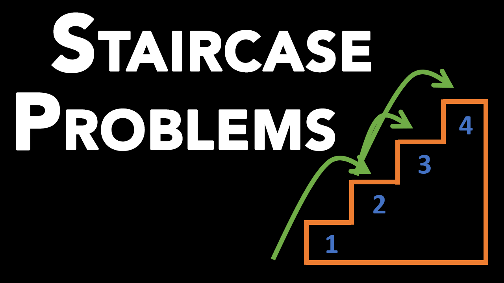

# Staircase Problem + 3 Variants - Different Ways to Reach the N'th Stair With M Different Steps
In a staircase problem, you try to calculate the different ways to reach the n'th stair where you are allowed to take up to m steps at a time. Say you are given a staircase problem with 5 stairs to climb, and you can take 1 or 2 steps at a time. How would you solve this problem? This and its variants are the focus of this article. It is a great problem to demonstrate the properties of dynamic programming and how to solve problems with it. Due to this, staircase problem and its variants like unique paths problem are commonly used as programming interview questions.

In this article, you will find the solutions to the following questions, as well as their time and space complexities:

* Medium Difficulty: Staircase Problem - Different Ways to Reach the N'th Stair: Given n stairs, you can climb 1 or 2 stairs at a time. Count the number of different ways that you can reach the top.
* Medium Difficulty: Generalized Fibonacci-like Sequences: Same question but you can climb up to m steps at a time.
* Medium Difficulty: Generalized Fibonacci-like Sequences With Variable Steps: Same question but you can only climb 2, 3, 6 steps at a time.

[](https://www.youtube.com/watch?v=qSE2iKRU4UA){:target="_blank"}

Table of contents:
* [Resources](#resources)
* [Overview](#overview)
* [Video Solutions](#video-solutions)
* [Staircase Problem - Different Ways to Reach the N'th Stair](#staircase-problem---different-ways-to-reach-the-nth-stair)
* [Generalized Fibonacci-like Sequences](#generalized-fibonacci-like-sequences)
* [Generalized Fibonacci-like Sequences With Variable Steps](#generalized-fibonacci-like-sequences-with-variable-steps)
* [Conclusion](#conclusion)

## Resources
You can find the video version of this article on YouTube: [https://www.youtube.com/watch?v=qSE2iKRU4UA](https://www.youtube.com/watch?v=qSE2iKRU4UA){:target="_blank"}

<iframe width="560" height="315" src="https://www.youtube.com/embed/qSE2iKRU4UA" frameborder="0" allow="accelerometer; autoplay; encrypted-media; gyroscope; picture-in-picture" allowfullscreen></iframe>

The video has illustrations for all the problems and their solutions. If you want to read the comments or leave a comment, do so under the YouTube video. If you want to contribute to the article, make a pull request on GitHub.

Solution code to examples are available on:
* [https://github.com/soygul/QuanticDev/tree/master/algorithms/dynamic-programming/fibonacci-puzzles](https://github.com/soygul/QuanticDev/tree/master/algorithms/dynamic-programming/fibonacci-puzzles){:target="_blank"}

My other articles relevant to staircase problems:
* My [Sliding Window Technique + 4 Questions](/algorithms/dynamic-programming/sliding-window){:target="_blank"} article, which will help you solve Fibonacci problems more efficiently.
* My [Big O Time/Space Complexity Types Explained](/algorithms/primitives/big-o-time-space-complexity-types-explained){:target="_blank"} article, which can help you refresh your memory on Big O notation:

Recursion visualization tool used in the article:
* [https://recursion.now.sh](https://recursion.now.sh){:target="_blank"}

## Overview
* Staircase problem is just a special case of "unique variations" questions like that of unique paths problem. I might make quick articles for those too, but you can apply the same methods that you will learn here to solve them also.
* You can identify variation finding questions if you are asked to find unique ways of doing XXX.
* Solutions to these problems are a subset of Dynamic Programming (the technique of solving a problem by dividing it into subproblems). We can solve them using recursion or iteration.
* Since solutions to these questions resemble Fibonacci Sequences, they are referred to as Fibonacci Puzzles, and they commonly appear in programming interviews and LeetCode. Especially the staircase problem!

## Video Solutions
If you want video solutions for the below questions, visit the YouTube link in the resources section. The video has a lot more in-depth info on solution techniques along with helpful visuals.

## Staircase Problem - Different Ways to Reach the N'th Stair
Question:
* Given n stairs, you can climb 1 or 2 stairs at a time. Count the number of different ways that you can reach to the top.

Difficulty:
* Medium.

Requirements:
* There are no bounds specified for n.

Analysis:
* There is no upper bound to n so recursive solutions might blow up the call stack.
* There is no lower bound specified for n so users might try to put in zero as the parameter. Write a test for n=0 case.

Formula:

To formulate a way to calculate all possible ways to reach a stair, think in reverse. What are the unique paths that lead to n'th stair. It is the sum of unique paths leading to n-1'th stair plus n-2'nd stairs.

* `ways(n) = ways(n-1) + ways(n-2)`
* ways(4) = ways(3) + ways(2)
* ways(3) = ways(2) + ways(1)
* ...

This is Fibonacci Sequence!

Tip: Visualize in a regular (forward) manner and trying to figure out a pattern/formula. If that does not work, try to think in reverse (i.e. reverse path in this question).

Calculate solution for n=4:
* Remember the formula: `ways(n) = ways(n-1) + ways(n-2)`
* ways(4) = ways(3) + ways(2)
* ways(3) = ways(2) + ways(1)
* ways(2) = ways(1) + ways(0)
* ways(1) = 1
* ways(0) = 1
* This is the iterative Fibonacci Solution!

### Solution: Iteration (Fibonacci Sequence)
* Remember the formula:
  * ways(n) = ways(n-1) + ways(n-2)
* Start with stair 0:
  * ways(0) = 1
* Continue with stair 1:
  * ways(1) = ways(0) = 1
* Continue with stair 2:
  * ways(2) = ways(1) + ways(0) = 1 + 1 = 2
* Calculate consecutive ones via adding the previous two until you reach n (stair count).
* Time complexity: O(n) (linear time)
* Space complexity: O(1) (constant space)

Code: Iteration (Fibonacci Sequence)
```
def ways(n):
a, b = 1, 1
for _ in range(n):
    next_b = a + b
    a = b
    b = next_b
    # shorthand: a, b = b, a + b
return b
```

### Solution: Recursion
* Start with `ways(n) = ways(n-1) + ways(n-2)`
* Recurse all the way down to ways(0) = 1, ways(1) = 1
* Time Complexity: O(2^n) (exponential time)
  * Size of recursion tree will grow exponentially. (visualization in a moment)
* Space Complexity: O(1) (constant space)
  * No extra variables allocated in mem per recursive call.
* Call Stack: O(n)
  * Depth of recursion tree will grow linearly.

Code: Recursion
```
def ways(n):
if n <= 1:  # Recursion needs to stop at some point!
    return 1
return ways(n-1) + ways(n-2)
```

#### Recursion Trees:

Below illustration demonstrates how inefficient recursive solution is. Notice the duplicated branches. They are the source of inefficiency. Solution for this is to use memoization.


Following is an illustration of how recursion tree is traversed in our `ways()` function with 5 steps:

<video width="1042" height="736" controls><source src="media/recursive_fibonacci_animation.mp4" type="video/mp4"></video>

### Solution: Recursion With Memoization
* Start with ways(n) = ways(n-1) + ways(n-2)
* Keep track of visited stairs in a knownWays hash table.
* Recurse all the way down to ways(0) = 1, ways(1) = 1 
* Time Complexity: O(n) (Linear)
* Space Complexity: O(n)
* Call Stack: O(n)

Code: Recursion With Memoization
```
def ways(n, knownWays = {}):
if n <= 1:
    return 1
if n not in knownWays:
    knownWays[n] =
          ways(n-1, knownWays) +
          ways(n-2, knownWays)
return knownWays[n]
```

Here is another animation of the execution of our memorized `ways()` function with 5 stairs:

<video width="1042" height="736" controls><source src="media/memoized_recursive_fibonacci_animation.mp4" type="video/mp4"></video>

## Tips
* If thinking in forward does not work, try to solve the problem backwards. Reverse thinking can help you find ways to utilize dynamic programming.
* If you want to see rest of my Algorithms Series, visit the home page.

## Generalized Fibonacci-like Sequences
Question:
* Given n stairs, you can climb up to m stairs at a time. Count the number of different ways that you can reach to the top.

Difficulty:
* Medium.

Formula:

We generate our formula again using reverse thinking. We will start form the top and calculate unique paths leading to top from previous steps.

*` ways(n, m) = ways(n-1, m) + ways(n-2, m) + ... + ways(n-m, m)`
* If m=3 (which means you can take 1, 2, or 3 steps at a time):
* ways(4) = ways(3) + ways(2) + ways(1)
* ways(3) = ways(2) + ways(1) + ways(0)
* ways(2) = ways(1) + ways(0)
* This is a Fibonacci-like sequence!

### Solution: Iteration (Fibonacci-like Sequences)
* Start with stairs 0 and 1.
* Calculate consecutive ones via adding the previous m numbers.
* Keep repeating previous step until you reach n’th number.
* This is essentially using sliding windows technique to calculate Fibonacci-like sequence. (more info next)
* Time complexity: O(m*n)
* Space complexity: O(m)

Code: Iteration (Fibonacci-like Sequences)
```
def ways(n, m):
stairs = [1]  # index = 0
for _ in range(n):
    stairs.append(sum(stairs))
    if len(stairs) > m:
        stairs.pop(0)
return stairs[-1]
```

## Tips
* Fibonacci sequences can be calculated in O(logn) time using Matrix Exponentiation or directly with the Fibonacci formula. This is probably an overkill for interview situations though.
* Write tests if you have time. Especially for corner cases like n=0, n=1, etc.
* Like the Staircase Problem, there are many more possible interview questions that can utilize Fibonacci-like sequences: Unique Paths Problem, Decode Ways Problem, etc. I will write separate articles for them so follow me on my socials if you don't want to miss them!

## Generalized Fibonacci-like Sequences With Variable Steps
Question:
* Given n stairs, you can climb x, y, z, ... (i.e. 2, 3, 5) stairs at a time. Count the number of different ways that you can reach to the top.

Difficulty:
* Medium.

Formula:

Once again, we formulate our solution using top-to-bottom approach.

* `ways(n, [x, y, z, ...]) = ways(n-x, [x, y, z, ...]) + ways(n-y, [x, y, z, ...]) + ways(n-z, [x, y, z, ...]) + ...`
* If x=2, y=3, z=5:
* ways(6) = ways(4) + ways(3) + ways(1)
* ways(5) = ways(3) + ways(2) + ways(0)
* ways(4) = ways(2) + ways(1) 
* ways(3) = ways(1) + ways(0) 
* ways(2) = ways(0) 
* ways(1) = 0
* ways(0) = 1
* Again a Fibonacci-like sequence!

### Solution: Iteration (Fibonacci-like Sequences)
* Start with the stair 0.
* Calculate consecutive ones via adding stair-x, stair-y, stair-z together.
* Keep repeating until you reach n’th stair.
* Time complexity: O(m*n)
* Space complexity: O(m) (m is the length of [x, y, x, ...])

Code: Iteration (Fibonacci-like Sequences)
```
function ways (n, possibleStepsList) {
const stairs = [1]

for (let i = 1; i <= n; i++) {
  stairs[i] = 0
  possibleStepsList.forEach(s => stairs[i] += stairs[i - s] || 0)
  // todo: trim the stairs array to save space
}

return fib.pop()
}
```

## Tips
* Memory efficient Fibonacci based solutions are essentially sliding window solutions. If you want to watch my dedicated article on "Sliding Windows Technique", I will put the link to it in the resources section above. The article has four easy to hard questions with solutions in it.
* If you want to refresh your memory on Big O notation, I have another dedicated article titled: "Big O Time/Space Complexity Types Explained" for you. The link to it is also in the resources section above.
* By the way, if you want to have some fun with the Big O notation, see my "Alternative Big O Notation" mugs and stickers at [quanticdev.com/shop](https://quanticdev.com/shop){:target="_blank"}


