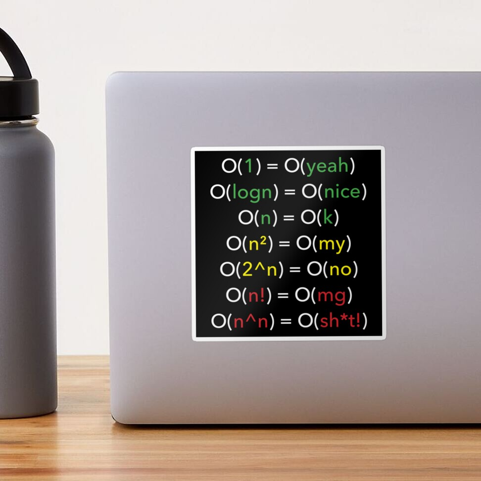

# Alternative Big O Notation
I always found things easy to remember when they rhyme, especially with humor. So, here is my take on big O notation, which can help you remember the rankings of big O types:

```
O(1) = O(yeah)
O(logn) = O(nice)
O(n) = O(k)
O(n^2) = O(my)
O(2^n) = O(no)
O(n!) = O(mg)
O(n^n) = O(sh*t!)
```

If you want to see my actual article explaining Big O time/space complexity types, here it is:
* [Big O Time/Space Complexity Types Explained - Logarithmic, Polynomial, Exponential, and More](/algorithms/primitives/big-o-time-space-complexity-types-explained){:target="_blank"}

If you want to have the alternative Big O notation as a sticker, so you can stick it to unusual places, you can get it from [quanticdev.com/shop](/shop){:target="_blank"}.

[](https://www.redbubble.com/i/sticker/Alternative-Big-O-Notation-by-quanticdev/54268092.EJUG5){:target="_blank"}

If you really want to confuse fellow software engineers, you can also get it as a small poster, bigger poster, framed print, hoodie, phone case, mug, blanket, or even a shower curtain!

[](https://www.redbubble.com/shop/ap/54268092){:target="_blank"}

**Side Note**: Asymptotically, O(n^n) is equal to O(2^n), so the last line in the alternative big O notation list is just for the humor's sake.

## Video?
Did I forget to say that there is also a video version of this article (!)

<iframe width="560" height="315" src="https://www.youtube.com/embed/3Jy8s3wdBBQ" frameborder="0" allow="accelerometer; autoplay; encrypted-media; gyroscope; picture-in-picture" allowfullscreen></iframe>
