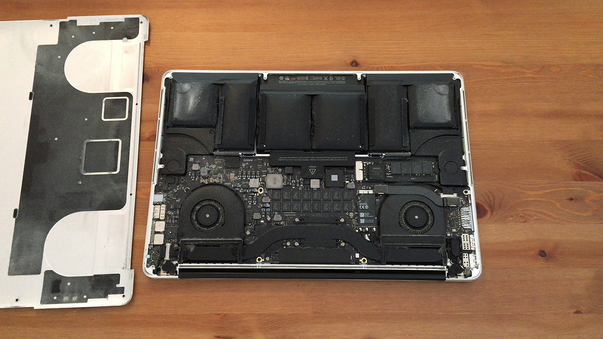

# Cleaning My MacBook After 16800 Hours of Use!
I estimated that I had used my mac for approximately 10 hours a day, 5 days a week, 48 weeks a year, for 7 years straight, for a total for whopping 16800 hours. I have written the first versions of most of the software components of my startup using this computer. And all this time, this machine worked without a hiccup. It was never repaired, and I never opened the back cover. However, its battery is getting swollen, so it is a good time to upgrade to a newer machine. Before recycling the machine, I decided to open it for once and vacuum the fans to see if it makes a difference. Oh boy, did it make a difference! You can find the fan test in the video if you want to check it out.

## Resources
You can find the video narration of this article on YouTube: [https://www.youtube.com/watch?v=W0qAMLShAkk](https://www.youtube.com/watch?v=W0qAMLShAkk){:target="_blank"}

<iframe width="560" height="315" src="https://www.youtube.com/embed/W0qAMLShAkk" frameborder="0" allow="accelerometer; autoplay; encrypted-media; gyroscope; picture-in-picture" allowfullscreen></iframe>

If you want to read the comments or leave a comment, do so under YouTube video. If you want to contribute to the article, make a pull request on GitHub.

Hacker News discussions on this article: [https://news.ycombinator.com/item?id=23583611](https://news.ycombinator.com/item?id=23583611){:target="_blank"}

# The Cleanup
I want to remind anyone who would like to try this to turn off their computers first. I don't care about this machine anymore, so I just left it in sleep mode. I also recommend setting the vacuum to minimum possible setting and be very gentle while sweeping. It would be very easy to suck in any loose components or wires. In addition, dust particles travelling inside the vacuum hose will build up some static. This can create some static discharge onto the electronic components. In my experience, this can only happen if you are cleaning something amazingly dusty, like an old desktop computer. If you have an air compressor available, it is a better option. Or you can keep holding the tip of the hose, to ground it at least a bit. For the record, I used a 1.2 mm P5 Pentalobe Screwdriver to open the back panel. You can find it pretty much in any hardware store.

Once I open the back panel, you can see that batteries are badly swollen. Even in that shape, they are stable, but I would not recommend trying to poke a hole in them. You would be likely to short circuit the inner panels, and it could start venting poisonous lithium gasses.

As you can see, both the fan blades and the heat pipe grills are clogged with 7 years' worth of dust! No wonder why the machine was overheating all the time.

After a throughout vacuuming, I let the CPU to run at max load for about 5 minutes. After 5 minutes, I could hear the higher-pitched airflow sound. Before cleaning, there was no airflow noise and only a low-pitched noise from the fans themselves. When I put my hand behind the monitor, I can feel the hot air flowing again. This didn't happen in years! Anyway, this is the final moments of this machine. I will leave it up for recycling. Or maybe someone will be willing to fix it and use it. We'll see.
