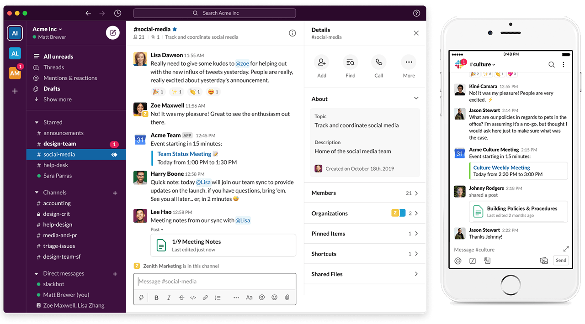
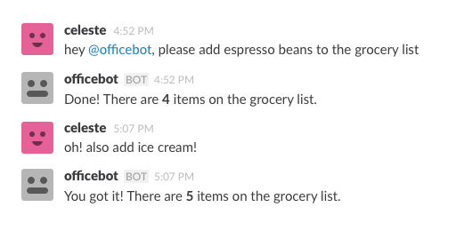
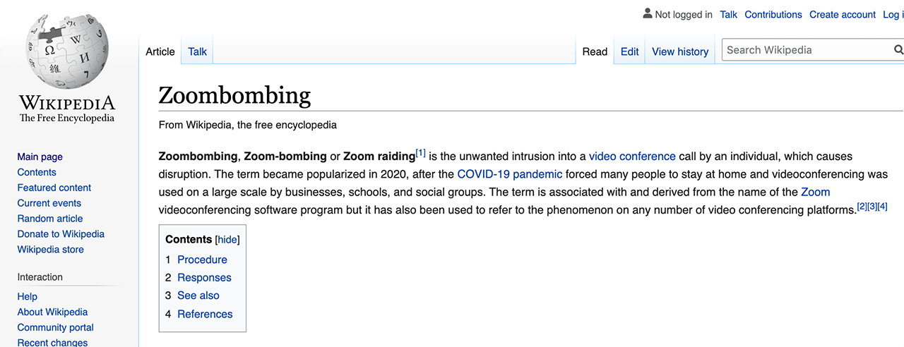
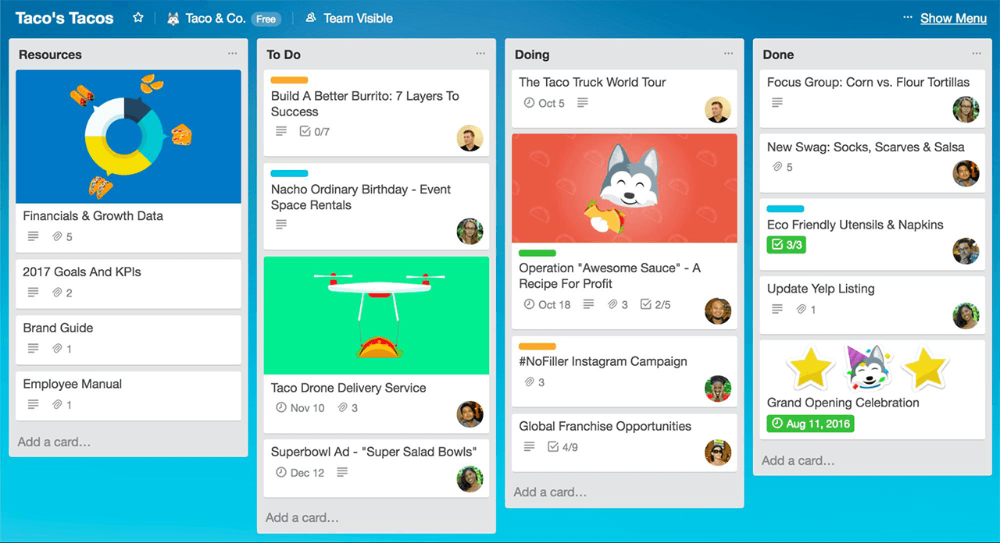

# Essential Software for Working From Home
Working from home is the new necessity, maybe even the future of many jobs. The University of Chicago recently published a paper on how many jobs can be done at home. Based on the study in the United States, they concluded that 34 percent of the jobs could be done at home, and those jobs account for 44 percent of all wages. That is a pretty significant percentage. Given the circumstances, there must be a lot of people scrambling to get their working-from-home setup going.

Today I am going to give you the essential list of software for working from home. Below is the software that I will review in this article. They are ordered based on my quality assessment, which you will see in the article:

* Team Chat
  * Slack
  * Google Hangouts
  * Microsoft Teams
  * Mattermost
* Video Conferencing
  * Zoom
  * Discord
  * join.me
  * Jitsi
  * Blue Jeans
* Online Office Suite: Mail, Calendar, and File Sharing
  * Microsoft Office 365
  * Google Suite
* Project Management
  * Trello
  * AirTable
  * Asana
  * Pivotal Tracker
  * Wrike
  * Jira (!)
* All-in-One
  * GitHub

## Resources
You can find the video narration of this article on YouTube: [https://www.youtube.com/watch?v=-gL_FHJX3mY](https://www.youtube.com/watch?v=-gL_FHJX3mY){:target="_blank"}

<iframe width="560" height="315" src="https://www.youtube.com/embed/-gL_FHJX3mY" frameborder="0" allow="accelerometer; autoplay; encrypted-media; gyroscope; picture-in-picture" allowfullscreen></iframe>

Video has additional tips for each principle discussed. If you want to read the comments or leave a comment, do so under the YouTube video. If you want to contribute to the article, make a pull request on GitHub.

The University of Chicago's White Paper: "How Many Jobs Can be Done at Home?":
* [https://bfi.uchicago.edu/wp-content/uploads/BFI_White-Paper_Dingel_Neiman_3.2020.pdf](https://bfi.uchicago.edu/wp-content/uploads/BFI_White-Paper_Dingel_Neiman_3.2020.pdf){:target="_blank"}

Relevant articles referred to in this article:
* [What Is the Most Valuable Thing You Can Learn in One Hour?](/articles/most-valuable-thing-to-learn-in-one-hour){:target="_blank"}
* [How to Correctly Use GitHub - My Full Workflow With Tutorial](/articles/articles/how-to-use-github){:target="_blank"}

## Overview
Working from home is the new necessity, maybe even the future of many jobs. Jonathan I. Dingel and Brent Neiman of University of Chicago recently published a paper how many jobs can be done at home (the link is in the resources section above). Based on the study in the United States, they concluded that 34 percent of the jobs could be done at home, and those jobs account for 44 percent of all wages. That is a pretty significant percentage. Given the circumstances, there must be a lot of people scrambling to get their working-from-home setup going. So let me get your working-from-home setup started with the essential tools.

## Team Chat
Communication is the primary requirement of any functional business. Asynchronous communication is especially important if the business is distributed over many time zones. This requires a team chat app where you can communicate mostly with text messages. In addition, you should be to share images, diagrams, documents, and more. My favorite tool for this task is Slack. 

I have been using Slack for the last 5 years, and it has been working a treat. When you pop open Slack in the morning, you can just click the "All unread" button and see all your new messages in all channels and start replying them. It is bliss. After WhatsApp, Slack must be the most stable chat app I have ever used. Given that Slack's scope is substantially bigger than WhatsApp, they are doing a good job. In addition, file, image, and video sharing have been working great. To have additional features like shared team whiteboard, task manager, or wikis, you can always use Slack apps from 3rd parties. 

On top of apps, you can use bots to automate mundane tasks like creating wiki entries from your chats, or even calendar entries.

A lot of team chat apps, including Slack, have built-in video conferencing. Almost all team chat apps also have very usable free tiers. However, their free tiers have some limitations, like only allowing a limited number of participants in video conferences. Same goes for storage space. For all the memes and cat video you can share in chat, you only get 5 GB of storage space for free. On the bright side, you can connect your Google Drive or other cloud file storage services to have additional space.

Other team chat apps that I can easily recommend are Google Hangouts, Microsoft Teams, and Mattermost. Some of the team chat apps are open-source, and some of them allow you to deploy them to your own server. I recommend investigating these alternatives based on your requirements. However, if you do not have time to do a proper requirements analysis for your team's needs or your needs are not obvious at first sight, you cannot go wrong with Slack.

## Video Conferencing
As I mentioned, most team chat apps now have adequate video conferencing capabilities. However, if you want a more feature-rich experience, you can try a dedicated video conferencing tool. They have some extra features like:
* Ability to host large meetings with more than 10 people.
* Ability to invite 3rd parties, like customer, to your video meetings.
* Ability to create public broadcasts/webcasts to thousands of people through a public conference room.
These points are a generalization, and it will differ from app to app. I would recommend going with the chat apps first and only introduce a dedicated video conferencing tool when you absolutely have to. As I always say to developers, start with the least number of tools that can get the job done. When using extra tools become inevitable, keep in mind that you are adding complexity to your setup.

So, let us start with the current most capable video conferencing service, Zoom. 

Having used video conferencing tools for more than a decade, I have never used something as stable as Zoom. It just works. Until Zoom, no other service I used offered a stable experience with 10+ participants. Some people sounding like they are talking through a walkie-talkie, no video on some others, and terrible echo on most... they just drove me nuts for years. Zoom seems to be handling the massively varied devices and connections of all participants quite well. I will not go into the technical details as they will get outdated in no time, but if you are interested, Google these magic words: "Zoom + WebRTC". You can then read what Zoom is doing behind the scenes and how it uses some technologies differently than others.

The alternatives that I can recommend, which will not give you a decade of pain and suffering are Discord, join.me, Jitsi, and Blue Jeans. If you want to do a public broadcast, you can even use YouTube Streaming or Twitch. All of these have free tiers so you can make your own comparison. However, if you do not have the time to do extensive research, starting with Zoom is a safe bet.

Finally, I always recommend Googling for current known security issues with any communication tool that you are about to use. Zoom recently had major security issues, and others can have them too.

Knowing about security issues beforehand can help you to avoid them or avoid that tool entirely. As always, never share confidential information like passwords in chat or a video call.

Tip: If you are going to install a chat app client or a video app client, do it through your operating system's app store. You never know if they try to install spyware on your computer while installing the app itself. Installing the app through the app store minimizes the chances of getting hit with malware, but still does not eliminate it. You can also use the web-client version of these apps in your browser without installing anything, but you will realize that they are a lot less capable than their installable versions.

Another Tip: I have an article on the most valuable things you can learn in an hour. If you want to learn something new while you are stuck at home, check it out. You will be amazed at small skills that you can add to your arsenal in a very short amount of time with minimal effort. The link is in the resources section on top.

## Online Office Suite: Mail, Calendar, and File Sharing
For an office suite that you can use online with minimal pain, you have only a few choices. Collaborative office suites that I can recommend are restricted to Microsoft Office 365 and Google Suite.

There are a massive number of tools that need to be in an office suite like a mail client, team calendar, file sharing, presentation software and more. Not every company can deliver all these tools at once, so you are either going to use Microsoft or Google or choose a collection of smaller tools. Even though online tools are likely to destroy your privacy, for strictly business purposes, I think it is well worth the considerable convenience that they bring. Most office suites have free tiers if you want to test them out as an individual. But for business purposes, they will roughly set you back $10 a user per month.

If you know better alternatives to Microsoft and Google in office space with a similar level of convenience, give me a hint in the comments section of the video version of this article.

## Project Management
I will keep this part simple. If you want project management, go with Trello.

It has everything you need. If you think you need more, you are just adding complexity to your setup. Every company finds excuses to add unnecessary complexity to their workflow via inventing not-so-essential requirements. But if you really like pain, the other alternatives that I can offer to Trello are AirTable, Asana, Pivotal Tracker, Wrike, and Jira (!).

## All-in-One
GitHub is a unique tool for technical people. You can literally use it for everything. You can share code; you can edit documents collaboratively; you can use it for project management, or even for website hosting, just as I do with QuanticDev website.

It is strictly for technical people so you will do a lot of command-line work, but if your team is made up of technical people, I have a great article explaining how I use GitHub on my daily development workflow for all my needs. If you want to see it, the link is in the resources section on top.

## Keep It Simple
I can list 50 more tools that would all sound essential, but keeping it simple triumphs everything else. Use the least number of tools necessary for your workflow. Keeping it simple will keep you happy and save your sanity. If you also want to keep other people's sanity, share this article with someone in need for a WFH setup. And I will see you in another guide.