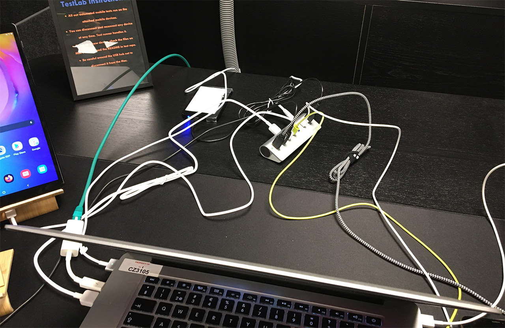
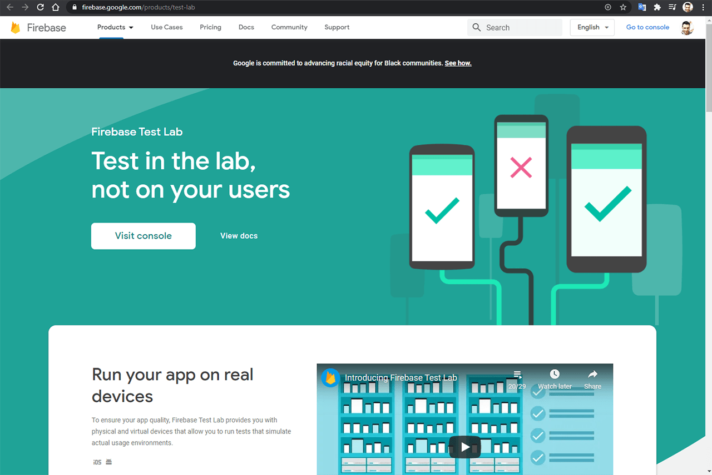
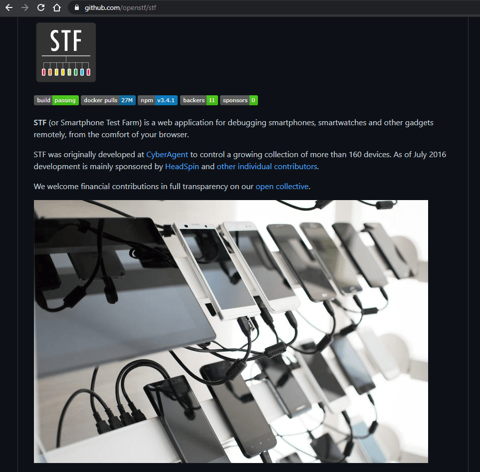

# How I Mass Refactored Our Production Codebase Without Fear - Engineering Stories
I recently mass refactored our production codebase at work. And I did so without the fear of breaking things. It was a full-stack refactor, and I did changes to our apps, test code and DevOps code. After finishing the mass refactor, I did zero manual testing. So, how did I do this? With the help of automated testing like this, of course:

<video width="1920" height="1080" controls><source src="media/device_farm-automated_testing_on_mobile_phone.mp4" type="video/mp4"></video>

In the rest of this article, I will give you a sense of how large refactors are done in production codebases of large enterprise products. I will talk more about the product that I worked on more in a moment. I will also explain the tools and technologies that helped me in the process of mass refactoring.

Table of contents:
* [Resources](#resources)
* [What Did I Do?](#what-did-i-do)
* [What is Our Product?](#what-is-our-product)
* [Why Was I So Confident?](#why-was-i-so-confident)
* [What is Automated Testing?](#what-is-automated-testing)
* [Device Farms and Test Labs](#device-farms-and-test-labs)
* [Conclusion](#conclusion)

## Resources
You can find the video narrative of this article on YouTube: [https://www.youtube.com/watch?v=oJEPBRrcyiw](https://www.youtube.com/watch?v=oJEPBRrcyiw){:target="_blank"}{:rel="noopener"}

<iframe width="560" height="315" src="https://www.youtube.com/embed/oJEPBRrcyiw" frameborder="0" allow="accelerometer; autoplay; encrypted-media; gyroscope; picture-in-picture" allowfullscreen></iframe>

If you want to read the comments or leave a comment, do so under the YouTube video. If you want to contribute to the article, make a pull request on GitHub.

Resources mentioned in this article:
* [My "Software Quality Assurance" video](https://www.youtube.com/watch?v=ztb8HNc2kCU){:target="_blank"}{:rel="noopener"}, where I describe how software companies test their products, starting with unit tests and going all the way to end-to-end (acceptance) testing level.
* [My "Method Chaining is Awesome" article](/articles/method-chaining){:target="_blank"}{:rel="noopener"}, which draws inspiration from some of the refactors that I did, which is the subject of this article.

Appium, which I recommend for automated desktop/mobile testing with a singular codebase:
* [https://github.com/appium/appium](https://github.com/appium/appium){:target="_blank"}{:rel="noopener"}

Remote (manual) mobile device testing software:
* [https://github.com/openstf/stf](https://github.com/openstf/stf){:target="_blank"}{:rel="noopener"}

## What Did I Do?
I have refactored our large production codebase over the span of four months. I did this refactor module by module and product by product. I have probably touched our entire tech stack during this (hence the importance of being a full-stack engineer!). I made changes to our clients (mobile and desktop) in their UI and core code. I adapted our tests code to the changes that I've done to the product. I have also changed our DevOps code extensively, to accommodate the changes I've done to the product and test code. Following animation is from my method chaining article, which was partly inspired by the changes that I did to our test framework. If you want to check out the full article, it is in the resources section above.

<video width="790" height="300" controls><source src="media/method_chaining.mp4" type="video/mp4"></video>

Changes were mostly technical (i.e. swap one JSON library with another, adapt the code to new UI libs, use method chaining in test code etc.) so correctness of the changes from product management perspective was not entirely relevant. However, verifying that functionality remained the same, and everything continued to work in production as-is was #1 priority. Further code level changes that I've done is not the point of this article so I won't dig deeper. I did most of my refactors using IntelliJ IDEA, which supports all the programming languages we use and has enormous refactoring capabilities. We also have a ton of static code analyzers, linters, and code reformatters built into our continuous-integration process, which was also very helpful in detecting defects at code level early on. Finally, our code peer-review process using pull-requests has the most important code quality assurance factor.

After I was done with the refactors, I made zero manual testing on our products. Neither did I have any fear of breaking things during this mass refactor. And oh boy, did break things! So why was I not fearful of breaking things? Because I knew that I could identify and fix what I broke during the refactoring process. I will talk more about our quality assurance tech in a moment.

## What is Our Product?
Our product is a large enterprise VPN software. It has been under development by a large team for the last 5+ years, so it has a considerably complex codebase. It has key hardware integrations, so reliability is quite important. When you integrate software and hardware features, you get a large surface area for bugs. Testing the hardware integrations is incredibly daunting since you need to get the hardware in test to the right state to test things correctly every time. In addition, we have clients for all major desktop and mobile OSes, and a vast DevOps infrastructure to automate the assembly of these clients. I want to leave a bit of mystery here, as I will write a separate article on what I do in my day-to-day work.

## Why Was I So Confident?
As a senior engineer, it is my duty to initiate and take on riskier projects. When done right, a large refactor and a refresh of the codebase can make working with the products a joy again. While initiating this mass refactor project, I was fully confident that I would not end up destroying our products, as I knew that a considerable number of automated end-to-end tests that I implemented over long years got my back. Also, I have recently created a mobile device farm, extending our end-to-end testing coverage to mobile devices. As you can see in the following photo, I have Android devices on the left and iOS devices on the right, and a MacBook as the host. All the connected devices are controller by the host machine:

Mass end-to-end testing like this, also known as acceptance testing, makes mass refactoring a less worrisome task. However, you still have to trigger tests every time you complete a part of your refactor and make sure to fix any broken tests or features. Depending on the test suite size and availability of automation hardware, this might take days. Of course, to verify the full correctness of my refactors, I had the run the entire test suite, and not just the end-to-end tests. Our unit and integration test coverage is also solid and they run on our CI servers as a part of our build process. Especially having integration tests that verify our software design decisions were invaluable, including our API endpoints and other 3rd party software integrations. Especially when dealing with our software's modules written in scripting languages (JavaScript, Python, etc.), our unit tests came in quite handy. I depend on those unit tests to verify that I broke none of the expected input/output types, as the compiler cannot do it for me in a dynamic programming languages

Before going into device farms, let me briefly mention automated testing.

## What is Automated Testing?
In summary, automated testing has three main parts:
1.	Unit testing. Unit testing tests the smallest sections of your code, which is mostly going to be your functions. You can even have multiple tests per function based on the behavior of your functions. And there are some great frameworks for it like NUnit, JUnit, Mocha, etc. which will help you organize your tests better.
2.	Integration testing. As the name suggests, integration testing tests the integration of your software components. For instance, one integration test can test the integration of multiple functions, classes, or even modules. You can use the same unit testing frameworks that I mentioned above for integration testing too.
3.	End-to-end (acceptance) testing. This is the endgame. End-to-end testing is where you test your product just like an end-user would do. You simulate real user interactions with your product using end-to-end testing frameworks like Selenium, Appium, etc. More on this in the next section.

I have a complete video on software quality assurance where I describe how software companies test their products, starting with unit tests and going all the way to end-to-end (acceptance) testing level. If you want to see it, link to it is in the resources section above.

## Device Farms and Test Labs
Now comes the fun part. This is where you get to play with your products on real devices. Of course, you don't want to play with the devices indefinitely; you want to automate that process. For my device farm implementation for our products, I used Appium, which uses Selenium's WebDriver protocol for all clients. Appium can control both web apps and native apps. It can even control hybrid web UI + native core apps (i.e. Electron apps). A single Appium server instance running in a host machine can control all the connected devices, and the apps and browsers installed on those devices:

In my implementation, I connected all our mobile devices to a single host machine via a USB hub, and the host machine is controller by Appium:

Now let's watch my device farm implementation in live-action in our office:

<video width="790" height="300" controls><source src="media/device_farm.mp4" type="video/mp4"></video>

As you can see, I have both Android and iOS devices connected to a single MacBook. Everything except for one power-hungry tablet is going through the USB hub. It is a little messy, but it has been working great. When someone triggers an automated test run, one of the devices is selected at random for the given platform. Then the entire test suit runs on that device, and the test results are collected. There is quite a bit of room for improvement, but this, along with our similar setup for desktop clients, enabled me to make extensive changes to our sensitive production codebase with confidence.

I want to emphasize that automated testing on real devices is substantially better than manual testing in the long run. You will save a ton of time via automation like this, and you can keep expending your testing coverage for your optimum quality assurance needs. You really don't need to take the route that I took and implement all these yourself. You can utilize ready-to-use device farms provided by Google Firebase Test Lab, Amazon Device Farm, etc.:

However, if you choose to implement your own device farm, remember that a lot of the publicly available device farms were born from internal implementations as I did. So you can always provide parts of your infrastructure as a service if you ever decide to go IaaS/SaaS route.

As a bonus in my implementation, people can RDP into the main test machine and control the phones remotely for manual testing when needed. Also, there are several apps that enable you to control the phones without RDP through a browser, like OpenSFT:

Finally, I arranged it so that any phone can be plugged/unplugged from the device farm at any moment. The test framework will select another available device and will continue running the tests. This is especially useful if you use some of these devices for manual testing or app development from time to time.

## What is Next?
Next comes the part where I add more devices to our homebrew device farm. I want to add devices of more varied screen sizes and OS versions. Especially testing some devices with older versions of Android would be great. It would also be great to have some Chromebooks attached to the farm, but I'm not sure if it is feasible with Appium. In addition, our end-to-end testing coverage will have to improve to handle new and upcoming features. Finally, I want to mount all the devices to a server rack. This will make the cable management easier, and will protect the devices from accidents. I'm also thinking of relocating everything to a more visible spot, so visitors can watch our apps being tested live!

## Conclusion
In conclusion, real-device testing using device farms is essential for quality sensitive products. I highly recommend it if you want to ensure optimum quality, especially if you have mobile apps. They also enable you to modify your codebase in the future with confidence, just like I did. You also don't need to build your own, you can use third-party device farm providers, and they offer reasonable pricing. If you have any recommendations for device farm providers, let me know, and I'll check them out.

Well, that is it for now. I promised more stories from real life, so here we are. If you like this type of real-world engineering stories, follow me on my socials so you won't miss my future writeups.
