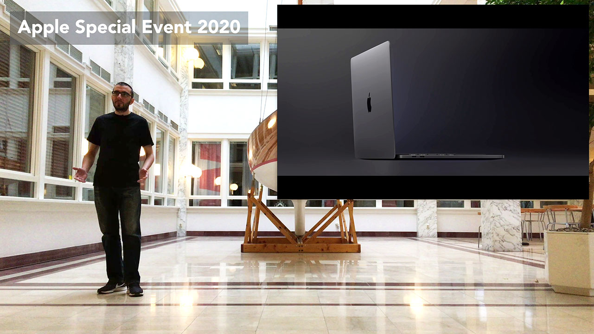

# How to Present Like Apple? - Recreating an Apple Keynote
This is an article and an accompanying video recreating an Apple Product Event. In this article (and complementary video), I will be introducing the new 16" MacBook Pro to the Special Event attendees and the press. And I will talk about the epic engineering journey behind the brand-new MacBook. I made this article and video to keep my presentation skills sharp while teaching others how to present like Apple (because, teaching is the best way of learning and re-learning).

## Resources
You can find the video narration of this article on YouTube: [https://www.youtube.com/watch?v=IuAIBY6NE6k](https://www.youtube.com/watch?v=IuAIBY6NE6k){:target="_blank"}

<iframe width="560" height="315" src="https://www.youtube.com/embed/IuAIBY6NE6k" frameborder="0" allow="accelerometer; autoplay; encrypted-media; gyroscope; picture-in-picture" allowfullscreen></iframe>

Video has additional tips and illustrations. If you want to read the comments or leave a comment, do so under the YouTube video. If you want to contribute to the article, make a pull request on GitHub.

Apple Logo Animation:
* [https://github.com/lorenzocadamuro/apple-fifth-avenue](https://github.com/lorenzocadamuro/apple-fifth-avenue){:target="_blank"}

## Stage Directions
[](https://www.youtube.com/watch?v=IuAIBY6NE6k)

This section is the script with the stage directions for the presentation. If you want to watch it, check the video in the resources section out.

[stage-direction: camera on the ground, looking up, so everything looks bigger]

[stage-direction: Black Apple logo centered on the screen with sunbeams around it, which is at the center of the camera. Walk to stage from outside of it slowly. Empty hands, no q-cards, well-rehearsed.]

[stage-direction: Video starts with Steve introducing original iPhone in 2007 and slowly fuses into mine.]

Good afternoon and welcome to the Apple Keynote, 2020. [stage-direction: smile & pause] We have always believed that by giving people access to the best possible tools at a reasonable price, you enable them to do wonderful things. At Apple, we put innovation and excellence at the center of everything that we do. With that innovation, we help people to learn, create, and work better and faster. And with the engineering excellence, we give them tools that they can depend on. On this day, you will get a taste of the fusion of innovation and excellence made by Apple, and made for professionals, once again. [stage-direction: audience cheers]

Every once in a while, a revolutionary product comes along, changing the way we perceive productivity. Luckily for you, you are going to whiteness one of those moments.

We have been building towards this moment for the last 30 years. In 1984, we introduced the first Mac. From that moment on, nothing was going to be the same again in the computer industry. In 1991 came the first PowerBook. It put the entire power of a Mac in your backpack, revolutionizing the portable computing. In 2006, we introduced the MacBook, redefining what a laptop could be. [stage-direction: back to glowing apple logo] And today, the saga continues. [stage-direction: pause & exited crowd applauds]

[stage-direction: sliding images for each phrase – walking towards audience] A brand new operating system. [stage-direction: macOS Catalina logo] A gigantic screen. An 8-core CPU. A brand new operating system. A gigantic screen. [stage-direction: audience laughter and pause] Are you getting it? [stage-direction: back to glowing apple logo]

Today, Apple is going to reinvent the laptop. [stage-direction: pause] Here is... the state-of-the-art, 16" MacBook Pro.

[stage-direction: MacBook Pro 16" intro vid – 15s]

And that is it. That is all you need to see. [stage-direction: audience laughter – throwing hands forward] Do not worry, there is more. But first, let me give you some astounding numbers.

This is the most powerful MacBook ever made. In fact, it has 2000 times the processing power of the very first Mac we ever built. It has the biggest screen to body ratio of any computer we ever produced. We fitted the largest battery ever we shipped with any MacBook. As a matter of fact, it is the largest capacity allowed on flights by the FAA. We have also redesigned our software lineup to work better with the new MacBook Pro. Both Logic Pro X and Final Cut Pro X now take advantage of the new hardware to its fullest.

Now let us have a look at the internals and see what is going on under the chassis.

[stage-direction: internals video starts]

The new MacBook Pro opens the same way. [stage-direction: audience laughter] It has 4 thunderbolt-3 ports. Combined with the versatility of USB‑C, you can connect anything to any port. And for the first time, our ever-praised unibody enclosure is made from 100% recycled aluminum. We re-engineered the new enclosure down to the atomic level, making it more durable and stronger than ever. And to your joy, it is the best-looking MacBook to this date.

To engineer the thinnest and largest retina screen to ship with an Apple laptop, we have refined every component. The glass, the bezels, the edges, everything is thinner. [stage-direction: throwing hands forward as if throwing something on the ground]

We continued to refine our keyboard design, to be more accurate and comfortable. It is a delight to type on these things; they provide so much more feedback than anything that we ever shipped.

[stage-direction: a going-wider hand gesture] While at it, we have completely redesigned the speakers to produce a crystal clear and room-filling sound.

Up to 8TB of SSD storage, 64GB of RAM, and the new 8-core Intel CPU, this is a monster of machine in your hands. In fact, it has the most CPU cores ever shipped on a MacBook. This amount of power needed better cooling, so we went ahead and redesigned fans. They cool your Mac 28% better while being quieter.

And to power all these, we have developed several new battery technologies. We actually changed the construction and the chemistry of the cells.

And oh, hey, we did not forget to put in the T2 chip. You still get the most advanced security on any laptop, along with the convenience of Siri.

To fit all these professional components into the MacBook, we took an extreme approach to miniaturization. All the parts were optimized and engineered to fit together to create the highest density Mac motherboard yet. It is actually 65% smaller than any we have designed before.

[stage-direction: small pause and wall towards the center of the stage]

All of these get together to give you an uncompromising machine, the most powerful and purposeful creative tool. The best MacBook ever made.

[stage-direction: audience cheers]

## Q-Card
This is only used during rehearsing the speech. Presentation can have these on a hidden prompter facing away from cameras and audience. However, it is always best to not relay on anything and practice until you can deliver the speech in full without any tips.

```
Good afternoon … 2020
best ... tools ... enable ... wonderful
At Apple ... innovation and excellence ... center
Innovation ... learn, create, and work
engineering excellence ... depend
fusion of innovation and excellence [stage-direction: wait for audience cheers]

perceive productivity
Luckily for you

last 30 years
1984 ... first Mac.
computer industry
1991 ... PowerBook.
power of a Mac in your backpack ... revolutionizing the portable computing
2006 ... MacBook ... redefining laptop 
saga continues [stage-direction: wait for exited crowd applauds]

[stage-direction: walking towards audience] operating system ... gigantic screen ... 8-core CPU
operating system ... gigantic screen. [stage-direction: wait audience laughter]
getting it?

Apple ... reinvent laptop [stage-direction: pause]
state-of-the-art, 16"

[stage-direction: wait for MacBook Pro 16" intro vid – 15s]

And that is it ... all ... to see. [stage-direction: wait audience laughter – throwing hands forward]
there is more.
But first ... numbers

most powerful MacBook
2000 times
biggest screen to body 
largest battery
FAA
software lineup
Logic Pro X ... Final Cut Pro X ... fullest.

internals ... chassis.

uncompromising machine, the most powerful and purposeful creative tool

The best MacBook ever made.
```

## Part 1 Conclusion
This is part 1 of my 3-part mini-series on how to Present Like Apple. This 5-minute video took me approximately 20 hours to make as a senior software engineer, including rehearsals and reshoots, along with another 10 hours for the follow-ups. In part 2, I will explain how this video was made, how the script was written, the equipment used, the animations, and all the other production details. And in part 3, I will do an in-depth analysis of presentation techniques used in this video, including the bold script and the story, the body language, the emphases, the stage and much more.
