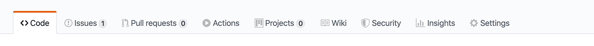
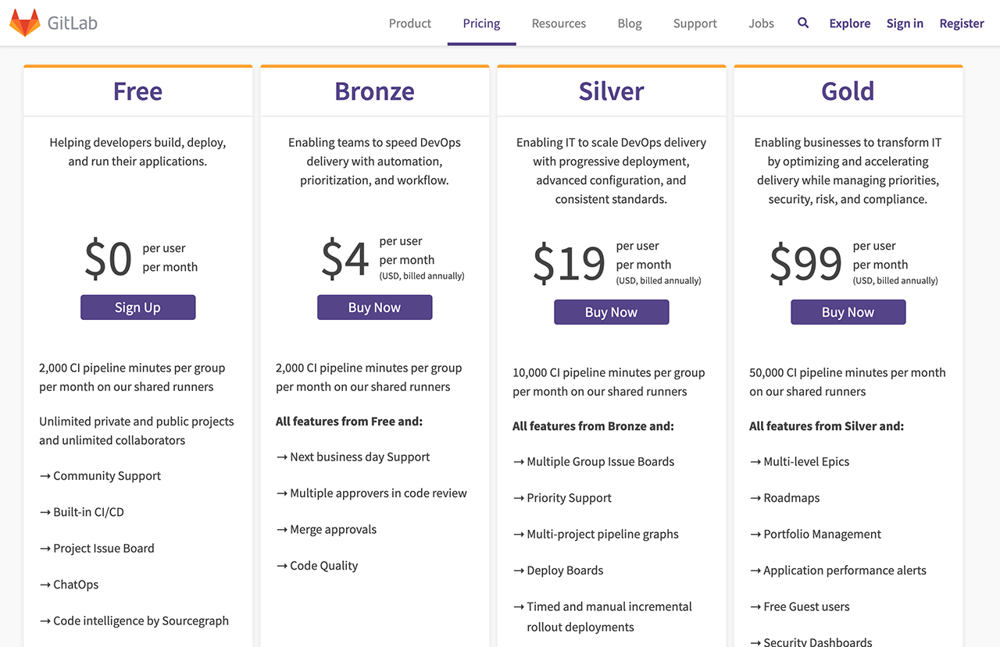
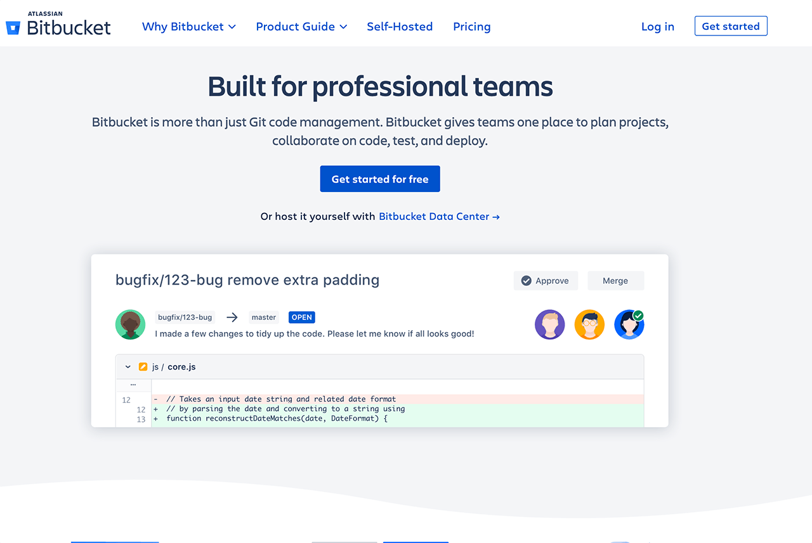

# How to Correctly Use Github for Software Development - My Full Workflow With Tutorial
I have been using GitHub for about 8 years now. Today I will enlighten you about how to use GitHub correctly for software development, which is a huge platform that provides code hosting, file hosting (with releases feature), issue tracker, project board, continuous build and integration, wikis, webpage hosting, and more. I will give you a brief comparison of GitHub to its alternatives, including locally hosted ones. I will also explain to you my personal Git and GitHub setup and how I use it. Finally, I will demonstrate my full software development workflow on my open-source "Android Docker" project, which is hosted on GitHub.

Table of contents:
* [Resources](#resources)
* [Why GitHub](#why-github)
* [Alternatives](#alternatives)
* [My GitHub Setup](#my-github-setup)
* [My Physical Work Environment](#my-physical-work-environment)
* [My Full Software Development Workflow Using GitHub](#my-full-software-development-workflow-using-github)
  * [Project Organization](#project-organization)
  * [Git Usage](#git-usage)
  * [Task #1: Replace Docker Base Image](#task-1-replace-docker-base-image)
    * [Applied Programming Principles](#applied-programming-principles)
  * [Task #2: Fix Directory Naming Conventions](#task-2-fix-directory-naming-conventions)
    * [GitHub Pull Request Flow](#github-pull-request-flow)
  * [Task #3: Deploy Image to Docker Hub](#task-3-deploy-image-to-docker-hub)
    * [Manual Testing](#manual-testing)
  * [Task #4: Project Publicity](#task-4-project-publicity)
* [Conclusion](#conclusion)

## Resources
You can find the video narration of this article on YouTube: Part #1 - GitHub Advantages, Alternatives, and Setup: [https://www.youtube.com/watch?v=xX8no5eRck0](https://www.youtube.com/watch?v=xX8no5eRck0){:target="_blank"}

<iframe width="560" height="315" src="https://www.youtube.com/embed/xX8no5eRck0" frameborder="0" allow="accelerometer; autoplay; encrypted-media; gyroscope; picture-in-picture" allowfullscreen></iframe>

Part #2 - My Full Development Workflow Using GitHub: [https://www.youtube.com/watch?v=wRAIY-RLSvo](https://www.youtube.com/watch?v=wRAIY-RLSvo){:target="_blank"}

<iframe width="560" height="315" src="https://www.youtube.com/embed/wRAIY-RLSvo" frameborder="0" allow="accelerometer; autoplay; encrypted-media; gyroscope; picture-in-picture" allowfullscreen></iframe>

Video has additional tips for each principle discussed. If you want to read the comments or leave a comment, do so under YouTube video. If you want to contribute to the article, make a pull request on GitHub.

* My "Android Docker" open-source projects used as an exercise in this article: [https://github.com/soygul/android-docker](https://github.com/soygul/android-docker){:target="_blank"}
* Alternatives to GitHub: [https://alternativeto.net/software/github](https://alternativeto.net/software/github){:target="_blank"}
* GitHub Flow guide: [https://guides.github.com/introduction/flow](https://guides.github.com/introduction/flow){:target="_blank"}

Relevant articles referred to in this article:
* [How to Set up a Free Website with GitHub Pages - How I Created quanticdev.com](/articles/website-with-github-pages){:target="_blank"}
* [Cleanest Linux Productivity and Development Environment using Manjaro Linux](/articles/manjaro-linux-productivity-machine){:target="_blank"}
* [Software Design Patterns, Principles, and Best Practices](/articles/software-design-patterns){:target="_blank"}
* [Software Quality Assurance - How Do Software Companies Test Their Products?](https://www.youtube.com/watch?v=ztb8HNc2kCU){:target="_blank"}

## Why GitHub
I am not proud of embracing a single vendor since they easily turn into monopolies. But the fact is, GitHub is pretty much the standard for sharing code in software development. And not only software development, but you can also find hardware blueprints, circuit schemas, or even websites and articles, just as I do with quanticdev.com. 

Tip: By the way, if you want to learn how I created quanticdev.com using only GitHub Pages and markdown, I have a dedicated article on that. The link is in the resources section.

GitHub has good alternatives, which I will get into later. But currently, it is a huge platform. As I mentioned, it has a great number of features to fill your development needs. 

All these features come for free and have paid versions with added features. You can even host GitHub locally on your own servers using the GitHub Enterprise version, but it is enormously expensive at a $250 per user per year pricing! 

You can frequently see hardware engineers hosting their projects on GitHub. Hosting non-coding related projects on GitHub is a less featureful experience, but it still provides all the project management features along with a ton of automation with GitHub Actions.

GitHub is free for public and private repositories. It is free for individuals, group projects, and enterprises. The paid tiers provide more features and resources, but you will not need them in smaller teams.

I must note that GitHub is now a Microsoft product and you might not like that. Just like many major Linux distributions did not like it. This includes Manjaro Linux, which migrated its entire codebase to GitLab. GitHub also has very broad terms and conditions, which basically gives them the right to terminate your account without warning at any time. However, this is generally the same for any content hosting provider, so always have offline and encrypted backups of your data.

## Alternatives
You can find the link that lists pretty much all the well-known alternatives to GitHub, in the resources section. But following are my favorites and here is how they stand up to GitHub:
* **GitLab**: Probably the 2nd most popular code hosting platform. It matches GitHub almost feature-by-feature, including GitLab Pages for free website hosting, and it is catching up on the missing features.  It has comparable free and paid tiers which are slightly cheaper. It even has a feature to migrate all your projects from GitHub to GitLab in one shot, including all your issues, wikis, etc. Just like GitHub, you can host GitLab locally on your own servers, and it has a free version too. The main reason as to why I do not use GitLab is their UI. I find their UI quite bloated. Compared to the clean-cut UI of GitHub, finding your way around GitLab is very difficult, but this is a personal opinion. Also, you can nest projects under groups, which makes finding your way even more difficult. I am pretty sure some customers requested the ability to nest projects and GitLab guys bowed to their requests. This is exactly why you do not always say yes to your customers. Extra features like nesting leads to complexity. It makes existing users happy but puts off new ones, including me!
* **Bitbucket**: Probably the 3rd most popular code hosting platform. Before GitHub offered free private repositories, everyone used to keep their private repos in Bitbucket.  This includes me, of course! However, once GitHub made private repos free last year, I closed my Bitbucket account and did not use it since then. Bitbucket is an Atlassian product, so I fear that it will end up becoming a super bloated platform, just like Jira has become. However, their existence is good for competition, which is also good for us.
* **Git**: You can set up and use a plain Git server with ease. Just Google and follow any tutorial, and you will be up and running in no time.  However, Git is only a code server. You will need additional tools for issue tracking, continuous integration, etc. You can hack around this by hosting a local issue tracker like Trac or Redmine, or just commit your issues to your repo as markdown files in an "issues" directory. You can also host Jenkins locally as your continuous integration server, which probably is already the no 1 CI server in the world. However, you will have to maintain all these yourself. In addition, I would not recommend opening these servers to the world via hosting them online, or else a single 0-day exploit can cost you your entire codebase, hence your trade secrets.

## My GitHub Setup
Start by creating an account on GitHub if you do not have one. I strongly recommend setting up 2-factor authentication to protect your account. For this purpose, I recommend using the Google Authenticator app on your phone. You should also backup your 2-factor authentication seed, which will be provided to you as a QR code or a simple string. Keep it in a safe and encrypted backup, or even on paper. At the end of the day, your code is your intellectual property, and you need to protect it. After that, create a sample repo and select the "Initialize this repository with a README" option to create the initial readme file. You can create and edit files right on the GitHub UI, so at this point, you do not even need anything else if your project is small enough. However, for bigger projects, you will want to have a clone of your repository on your machine. For this, you can use GitHub's own desktop client app. It will guide you through all the steps for cloning your repo locally, and it is very easy to use. Even I used to use it until I was sufficiently good with the git command line.

If you are a seasoned guy, you can use git from the command line, and that will be all you need. I suggest you create a strong SSH key using elliptic curve crypto so that you will be future proof. I will not go into the details of command line cloning, but I recommend gradually switching to a command-line only workflow. It will save you ton of time in comparison to using the GitHub desktop app.

One final thing is to remember to backup all your GitHub data from time to time. Go to your account settings page, click "Start export" in the "Export account data" section and you will receive a mail when your entire account, along with your repos, are zipped into a file. Do this from time to time to have all your data offline.

## My Physical Work Environment
Before anything, here is how my work setup physically looks like.

I like keeping a clean desk with minimal clutter, so I do not get distracted. I am using an early 2015 MacBook Pro, which is the last MacBook Pro without the butterfly keyboard. I knew that Apple would screw the new keyboard, so I rushed to buy a MacBook with the old and robust keyboard design. It turned out to be the investment of the century since all the new MacBook keyboards are plagued with malfunctions.

I use a high precision gaming mouse and a good mousepad since it makes doing precise movements with the mouse easier. It is especially useful while creating graphics for my apps and games or editing videos.

I have a 4K 30" monitor in front of me, but I only use it while demonstrating something to someone else on my desk. Otherwise, I only use the Mac's monitor. Since I want to be distraction-free, I use every app in full screen. This eliminates the need for an external monitor since it only makes the full-screen apps bigger. This may or may not work for you, but it helps me keep a laser-like focus.

Tip: I have used my Mac for this article, but I mostly use my Linux machine while I am working on my open-source projects. If you want to learn how to set up a Manjaro Linux machine for development and be quite productive with it, I have a dedicated article on this topic, and the link is in the resources section. I will also have a separate article on how I use my Mac for programming and other tasks. So, watch out for that.

## My Full Software Development Workflow Using GitHub
Here is how I use GitHub in my day to day development tasks. For this example, I will finish the remaining tasks on my "android-docker" open-source project, which helps people to build their Android projects inside Docker containers. It is a free and open-source project hosted on GitHub. If you want to check it out or use it, the link is in the description.

### __Note: Rest of this article is the script of my GitHub videos. If you want to see me in action working on my project, check the videos out in the resources section.__

## Project Organization
I like keeping my repos simple. I try to have all my documentation in simple readme files in markdown rather than using the "Wikis". I also like keeping my issues list clean, and close stale issues whenever I can. It is even possible to set up a "Stale Bot" for this purpose, but I did not do it yet. Finally, I touch the settings only when I need to. There is no need to complicate the repo configurations.

Now I will go ahead and finish my pending tasks in my android-docker project. Let us start by checking out the "Issues" tab to see all the tasks. I always start by prioritizing my tasks. Never let trivial but unimportant tasks get in the way of important work. Especially in open-source projects, you will have an endless stream of tasks to do. Always start with the important ones. For this project, updating the version numbers of the dependencies is important to do before anything so let's begin by doing it.

## Git Usage
I will switch to my Git repo using command line and do a `git status` to see the status of my repo and my current active branch. `git status` command shows that I have uncommitted changed from a previous work session so I will start by investigating it with a `git diff` command, which will display all uncommitted changes. My changes seem intentional, so apparently, I just forgot to commit them. Let me commit them with `git commit` so I can start with a clean Git status.

Once my Git repo is ready for action, I will switch to my code editor. I use Visual Studio Code for smaller projects and IntelliJ for larger ones. I will quickly update the base image version and other dependencies in my Dockerfile, which include Android SDK, build tools, and NDK. After the versions of the dependencies are updated, I will go ahead and update the Readme file. I want to add a section clearly stating that this project tracks the latest versions of Android tools, and anyone with a specific version need should modify the Dockerfile according to their needs and rebuild the image. After that is done, I will do a `git diff` again to review the changes that I have just done, and commit and push them to my GitHub repo. We can verify that changes are pushed to GitHub via visiting the project page and refreshing it. The latest commit message with our updated version numbers will appear on top. After that, I will go to my task list and close that issue. I try and write descriptive close-messages for tasks, even in solo projects. It will help my future self greatly.

## Task #1: Replace Docker Base Image
I will move onto the next most important task, which is about replacing the base image that I use for my Dockerfile. When creating a Docker image, it is a good idea to base it on another base-image, so you get the most useful tools ready to go. For my project, I am using an Ubuntu base image. However, it is almost 100 MB in size and I want to replace it with something lighter. So, I start by Googling around for lighter base image variants, including Apline Linux and Debian lite. However, I quickly realize that Alpine Linux has a different package manager, which means existing users of my Docker image, including myself, would have to relearn a whole new different package manager syntax. In addition, Debian lite does not turn out to be much lighter than Ubuntu base image either. So, I decide to close the issue with a descriptive closure message that says that added complexity of switching base images is not worth saving a few megabytes. I will also leave a comparison of image sizes between Ubuntu and Alpine in that task for future reference.

## Applied Programming Principles
I must say that this was a great demonstration of Y.A.G.N.I. principle in action, which stands for "you ain't gonna need it". There will be tons of tasks that you assume you need to do, or features you feel you need. When you do your research and do a cost vs benefit analysis, not going ahead with that task could turn out to be the best option, as it was in my case here. Y.A.G.N.I. principle preaches this; always think deeply on whether you actually need to do what you plan to do. Analyze the complexity that you might be about to add to your project, see if you can reuse existing work, or just skip it entirely. There are many more such programming principles to keep in mind while making project-related decisions. If you want to learn more about them, I have a separate article for it, and the link is in the resources section.

## Task #2: Fix Directory Naming Conventions
While analyzing whether I should change the base image of my project, I have realized that the naming convention of my project directories were a bit off. So, I will go ahead and quickly create a task describing the issue. I always try to create tasks for things, even when I plan to do them right away. The issues list serves as a good summary of what has changed or is about to change, so it is a good way of documenting the work, even if it is to be done immediately. After creating the task with a good description, I go ahead and start experimenting with different project directory naming conventions until I settle with one that I feel good with. Many programming languages come with guides on how to name your files and directories. Since Docker is not a programming language, but rather a tool, it lacks such guidance, so it is up to your intuition and experience to come up with the best convention. Since this is a rather simple task, I will not go into the details, but I quickly wrap up the name changes and commit them to the repo and close the task.

## GitHub Pull Request Flow
For the next task, I decide to go ahead with the one that is related to pushing my new Docker image to Docker Hub. This might require non-trivial changes to the project, so I will use what we call the GitHub Flow or Pull Request Flow. Let me start by explaining GitHub Flow:
* I will start by checking out a fresh new branch. I will do all my work for this task on that branch. To signal everyone else that I am working on that branch, I will push it to GitHub.
* Commit by commit, I will push my work to that branch. I try to make a commit every time I complete an important part of the task. I also try to write descriptive commit messages, since it is important to document your work and changes done to the project by that commit.
* Next is to create a pull request through GitHub's UI. Making a pull request signals my teammates that I am done with that task, so my changes are ready to be reviewed.
* Before finally merging my changes, someone, or myself, will review the code and test it. It could be via deploying the changes to a test or staging environment.
* Finally, I will merge the changes and close the related task as successfully done.
* GitHub's own documentation on GitHub Flow is pretty good, and I put the link in the resources section if you want to check it out for more info.

## Task #3: Deploying the Docker Image to Docker Hub
Now I will continue with the task in hand of readying my project to be deployed to Docker Hub. I checked out a new branch for it, and I will proceed by Googling how to push an image to Docker Hub to see the requirements for it. Apparently, the official documentation on Docker's website is pretty good, so I will follow it. As a matter of fact, copying everything command-by-command worked in my case!

Next up, I need to update the Readme section in Docker Hub. Since I do not want to maintain two separate readmes for GitHub and Docker Hub, I will look around and see how other projects do it. It turns out it is possible to automate Readme creation if I enable Docker Hub and GitHub integration, but for the moment, I will just modify my Readme to fit both hubs and copy-paste it to Docker Hub manually. After I am done with the changes, I will create a pull request on GitHub. First line of description in the GitHub Pull Request will be the magic word: "Fixes #1". This is a reference to an issue in the GitHub's issues list. When I merge this pull request, the referenced issue will be automatically closed for me. GitHub has several other such magic words, and I will leave it up to you to discover with joy. Since this is a solo project, I will review my own changes and merge them myself. I will also delete the branch that I have used for this pull request since I do not have any other use for it. Finally, I will go to the referenced issue to verify that it was automatically closed for me.

## Manual Testing
Now is the time to manually test the project. Entire purpose of Android Docker project is to build Android apps inside Docker containers. So, let's start by creating a sample Android project with Android Studio. The project must be in the "/build" directory of our repo root. Once that is set, and the Android Studio finishes creating the project, I will build it using the Android Docker command line. Once the build is finished, I can boot up an Android emulator so I can install the freshly built Android app. I will find and drag the APK file from the "build" directory onto the Android Emulator and wait for the install to finish. After our APK is installed on the emulator, I can start the sample app.

As you can see, it seems to be working perfectly well. Android Docker successfully built the project, and everything is functional. If this were a bigger project, I would automate this testing, but for now, manual testing should suffice.

Tip: I have another article describing Software Quality Assurance in depth. It goes into details of manual and automated testing strategies and gives you an idea of how larger software companies test their products. If you want to see it, the link is in the description.

## Task #4: Project Publicity
Now onto the final task. Since my Docker Hub image is ready for action, I want to announce it to the world. Social media is generally a good place for this. I will start by putting out a tweet with a link to the project's GitHub and Docker Hub pages. I will also use appropriate hashtags so people browsing those hashtags can find my project. I will reuse the same title and link from that tweet and post it on Reddit also.

A word of caution! Social media is a chaotic place. The feedback you get will vary massively. If you create a genuinely useful project, people will find and use it. However, giving it an initial kick and getting some feedback is excellent, as long as you have the nerve to deal with "The Anonymous".

This is all I have planned to do for my android-docker project. As people use it, new issues will accumulate, and I will have to take care of them. Then I can make another follow up tutorial on how I handle ongoing feature requests and issues on an open-source project.

## Conclusion
GitHub is a fantastic tool. It brings a full suite of software development tools in one package, and it is adding new features regularly. Being owned by a big enterprise company like Microsoft might mean it can stop innovating and become stale, but until then, it is the best of all options. I highly recommend using it for your private or open-source projects. I also recommend using it to its fullest; i.e. use GitHub Issues and Project board instead of using a 3rd party project management tools like Trello. Keep your workflow as simple as possible and altogether so when you need to backup or migrate your data, you can do it in one shot. If you want to learn and use GitHub but do not have a project at the moment, contribute to open-source projects on GitHub. Start with the simplest tasks like updating Readme files and move on from there. It will make you a better developer while helping the community, and learning Git and GitHub.
