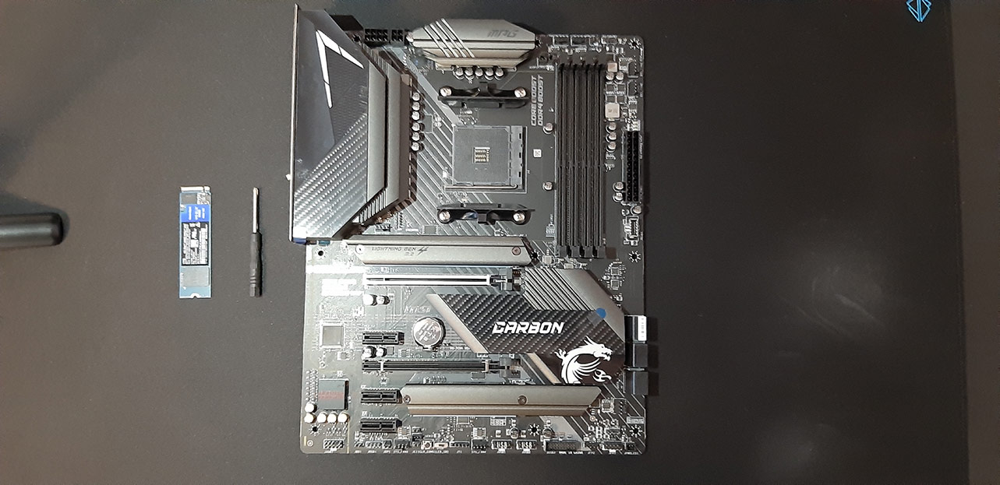
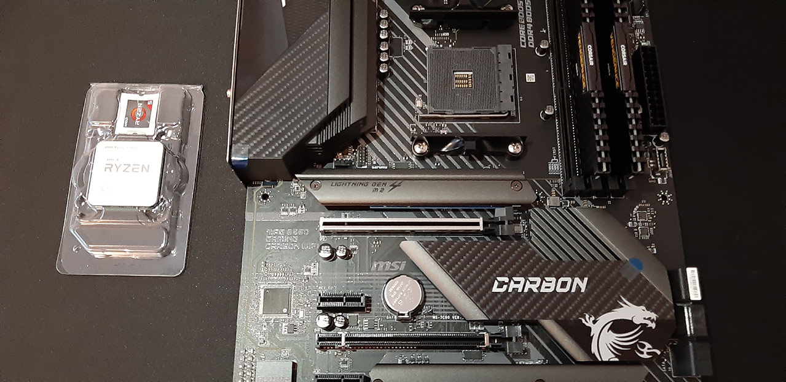
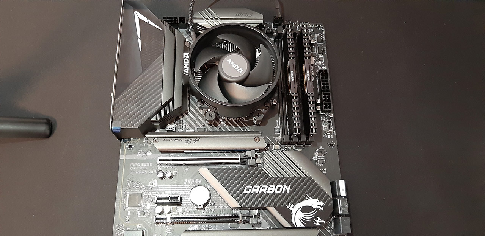
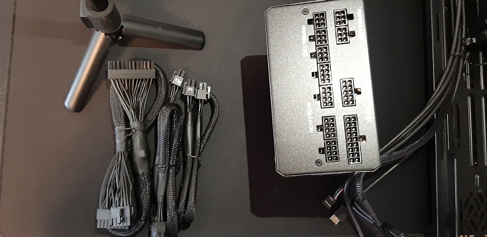
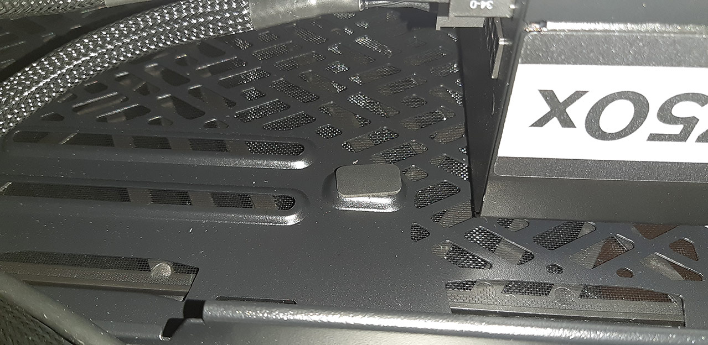
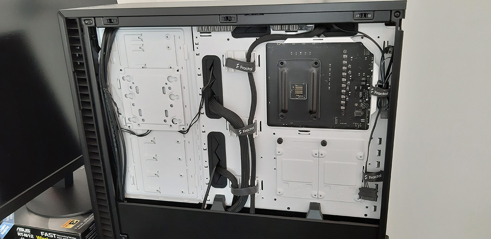
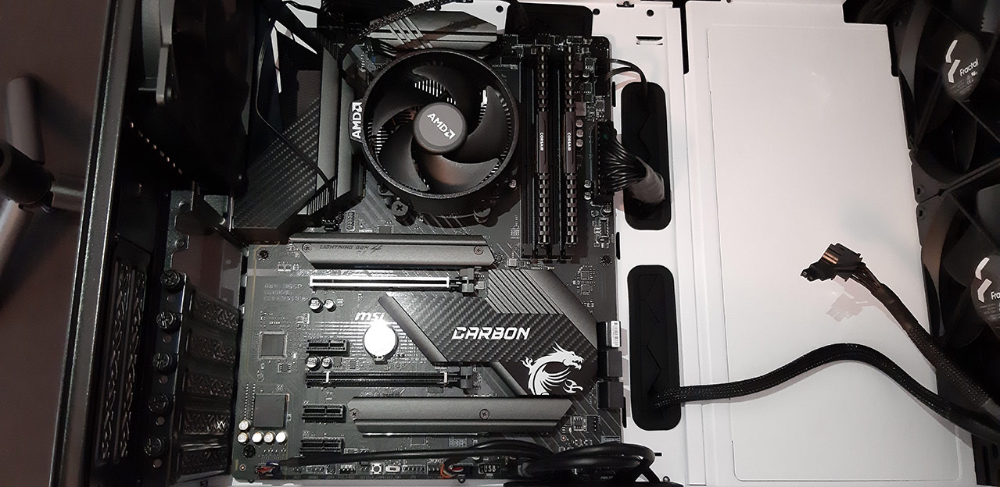
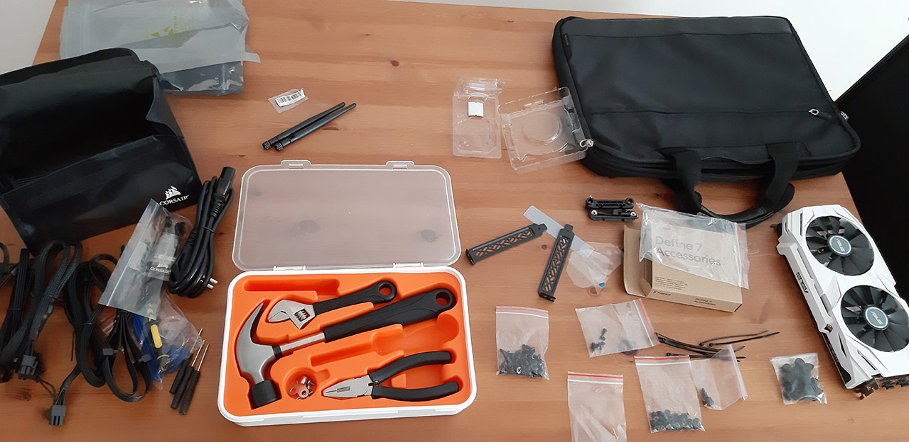

# Maximum Value PC Build by a Software Engineer - Complete PC Build Guide

Today we will build a PC from scratch with the maximum possible value for the money. I am a long time Mac and Linux user on the laptop side for my software engineering tasks, but I am tired of the fan noise. So, I decided to create a desktop build and get the maximum bang for my buck, while retaining great upgradability. I would like to remind you that this build is targeting mainly programming with lightweight photo/video/3D work. You can find the specs in the next section.

Table of contents:
* [Overview](#overview)
* [PC Specs](#pc-specs)
* [Choice of Components](#choice-of-components)
* [PC Build Guide](#pc-build-guide)
* [OS Installation (Manjaro Linux)](#os-installation-manjaro-linux)
* [Settings](#settings)
* [Conclusion](#conclusion)

## Resources
You can find my live PC build video on YouTube, in case you want visual instructions: [https://www.youtube.com/watch?v=LUE3avxvPMA](https://www.youtube.com/watch?v=LUE3avxvPMA){:target="_blank"}

<iframe width="560" height="315" src="https://www.youtube.com/embed/LUE3avxvPMA" frameborder="0" allow="accelerometer; autoplay; encrypted-media; gyroscope; picture-in-picture" allowfullscreen></iframe>

If you want to read the comments or leave a comment, do so under the YouTube video. If you want to contribute to the article, make a pull request on GitHub.

Quantic Developers Club stickers and posters if you want to decorate your new PC:
* [quanticdev.com/shop](https://quanticdev.com/shop){:target="_blank"}

Best value CPUs & GPUs by price/performance index:
* [https://www.cpubenchmark.net/cpu_value_available.html](https://www.cpubenchmark.net/cpu_value_available.html){:target="_blank"}
* [https://www.videocardbenchmark.net/gpu_value.html](https://www.videocardbenchmark.net/gpu_value.html){:target="_blank"}

My [Cleanest Linux Productivity and Development Environment using Manjaro Linux](/articles/manjaro-linux-productivity-machine){:target="_blank"} article which will hep you with the first-time OS installation and developer environment setup.

## Overview
PassMark benchmark software has a great website where you can keep track of the price/performance index of CPUs and GPUs that are available on the market, so I used that to choose the components. Keep in mind that PassMark is a synthetic benchmark, so it will match workstation workloads like programming and graphics design better than gaming. On a side note, even though I've studied semiconductor physics and electronics, they were of no use while doing this build. Microelectronic circuits you study in college are very low level, and PC parts are higher level components. Obviously, semiconductor physics is also completely irrelevant to a PC build!

Let me give you the specs right away, and then I will tell you what I plan to do with this build.

## PC Specs
Parts list with affiliate links if you want to help out the website:

* CPU: AMD Ryzen 5 3600: ~$200: https://amzn.to/32yqDUk
  * Alternative: Ryzen 3 3100/3300X: ~$100: https://amzn.to/3hC4AjZ
  * Future: Ryzen 4600/4300X/4100 or 5600/5300X/5100 when they are out.
* GPU: NVIDIA GeForce GTX 1650 SUPER: ~$200: https://amzn.to/3kiMAMY
  * Alternative: GTX 1060 6GB: ~$100: (check out Ebay)
  * Future: GTX 3060 when it is out.
* MOBO: MSI X570 Tomahawk WiFi: ~$200: https://amzn.to/3iCEcHW
  * Alternative: MSI B550 Gaming Carbon WiFi: ~$200: https://amzn.to/2E6dNTM
* RAM: Corsair Vengeance LPX Black DDR4 3200MHz 2x16GB: ~$150: https://amzn.to/3ks0UmH
* SSD Disk (NVMe): WD Blue SN550 M.2 2280 1TB: ~$100: https://amzn.to/3iD2W2P
* Power Supply: Corsair RM750X V2 750W: ~$120: https://amzn.to/2Rz7v2g
* Chassis: Fractal Design Define 7: ~$150: https://amzn.to/32AGaD7
  * Alternative: Fractal Design Meshify C: ~$90: https://amzn.to/32B2mgr
* Keyboard: HyperX Alloy FPS: ~$70: https://amzn.to/3hDegdK
* Mouse: Logitech G502: ~$50: https://amzn.to/3c2CTj3
* Headset: Logitech G Pro: https://amzn.to/3muTT68
* Desk Speaker: Creative Pebble V2: https://amzn.to/32AJmhV
* Total: ~$900 - ~$1200

If you want to replicate parts of this build and if you want to help the QuanticDev website, you can use the Amazon affiliate links above, so the website will get a percentage of your purchases. I generally recommend getting your parts from no more than two different sources, so the returns and repairs won't be a nightmare.

## Choice of Components
Before starting the actual build, I want to talk about my component choices. Remember that I chose my components with primarily software engineering and light video/photo editing in mind.

Starting with the CPU, if we refer to the PassMark website, you can see that I didn't choose the top item in the list since it is an Intel CPU and I do not want anything Intel. I didn't choose the Ryzen 3100 either since I wanted something with at least 6 cores. Neither did I choose the Ryzen 2600 either, even though it has 6 cores, as I wanted a latest-gen CPU to get the best power efficiency. So, you see that these price/performance indexes are not the cannon. You still need to do your own research and choose the components that satisfy your requirements. At the end of the day, requirements analysis is the most important step in software engineering! I would have loved to get a Ryzen 4000 series processor, but they are not even announced yet, and I know that availability will be a problem when they come out. Also, I decided not to get a custom CPU cooler since it is not necessary for a measly 65W CPU. When I upgrade to a higher core count Ryzen 4000/5000 CPU, I will get a Noctua NH-D15 to go with it.

On the GPU side, I didn't choose the first item in the list again since I want an NVIDIA card. I want those sweet CUDA cores, along with stable drivers. So GTX 1650 SUPER 6GB was my choice. While waiting for my shipment, I got my hands on a GTX 1060 6GB for only $100. So decided to go with it, which almost as powerful as a GTX 1650 and is half the price. I need 0 graphics power for my programming tasks, and GTX 1060 is more than enough for my video and photo editing adventures. I'm planning to upgrade to GTX 3000 series in the future if they prove to be great value cards.

 For the motherboard I wanted an MSI X570 Tomahawk, but it wasn't available, so I went with an MSI B550 Gaming Carbon instead. They are roughly the same board, and on the plus side, B550 does not have a chipset fan. 32GB RAM and 1TB SSD are minimum if you want to run several virtual machines on your computer. Do not forget to check your motherboard manufacturer's page to make sure that the exact model of your RAM is compatible with your mobo. I also recommend an M.2 NVMe SSD since they are so much smaller and faster. For the power supply, calculate the power draw of your CPU/GPU combined and get something double that. This way, your power supply fan will rarely need to turn on. For the chassis, I wanted something big in case I want to install a spinning disk array in the future. Mouse and keyboard are very personal choices, so they are on you. You can also get some small desk speakers or a headset, as it suits you.

## PC Build Guide
Now let's build some value! You can use the rest of this article as a PC build guide as I will explain all the intricacies of building PC with modern components. If you want to watch this guide as a video, check the YouTube link in the resources section above.

It is important to start with the M.2 NVMe SSD since it will be covered by other components soon. Use the M.2 slot closest to your CPU since it will generally be the fastest one. On my B550 board, it is the only PCIe 4.0 slot for M.2. Consult your motherboard's guide if you are unsure of the M.2 socket locations. Start by unscrewing the heatsink. Turn the heatsink around so you can peel off the protective plastic from underneath the heatsink. You will realize that there is a dent on the connection side of the SSD. This dent should align with the one on the mobo. Place the SDD on the socket and apply moderate amounts of force to slide it in. Use the M.2 screw bundled with your motherboard to screw the card in. Finally, screw the heatsink back on. By the way, the heatsink on the mobo chipset might also have plastic over it, don't forget to peel it for maximum cooling.

Now onto the RAMs. It is important to continue with the RAMs in case if you have a big heatsink that will block the slots. Unlike the M.2 SSD, you want to start by populating the socket furthest away from the CPU. You want to give the CPU as much breathing room as possible. In addition, you want to have one socket empty between the sticks if you only have two. This ensures that the RAMs work in dual-channel mode. So, we will use the socket 2 and 4. Make sure to align the dent on the RAM stick with the one on the mobo, just like we did for the SSD.

Onto the CPU. Be very careful with the CPU; it has thin and very bendable gold-coated pins. The CPU will only fit the socket at the right orientation. To find it, check for the gold-coated corner of the CPU. It should match the marked corner of the mobo. If you are unsure, turn the CPU so that the text "RYZEN" is readable from the mobo's I/O panel side. Raise the CPU arm on the mobo and put the CPU in. It should slide in with no force. If it doesn't fit, do not push it in or you will bend the pins. Check the orientation and let gravity do the work. Now lover the CPU arm back in, and the processor is secured in place.

Next, let's install the fan. I find Ryzen's bundled cooler adequate for a 6-core processor so I won't go with a custom cooler. As a result, we don't need the pre-installed aftermarket cooler brackets. Remove the brackets with a screwdriver. Be extra careful when removing the cooler from its packaging since it has the thermal pad pre-applied, and if you touch the bottom of the cooler or put it down, it will peel away. Before putting the cooler on the CPU, make sure that screws do line up with the screw holes on the mobo. If you are unsure, just turn the cooler so that "AMD" logo on the shroud is on the I/O panel side. After tightening the screws, connect the fan power cable to the power header labeled "CPU_FAN" on the mobo.

Now it is time to place the mobo inside the chassis. Put the chassis on your desk sideways and check out the mobo screw sockets on the chassis. The default configuration will be for ATX mobos. If you have a smaller motherboard, you might have to rearrange the screw sockets. You can easily unscrew the screw sockets if you need to. Just make sure that they match to the holes on your mobo. If the chassis back fan is pre-installed, don't forget to remove it before putting in the mobo so it won't get in the way.

After the mobo we'll need to install the power supply. In our case, we only need 3 cables; 1x 24-pin mobo power cable, 1x CPU, and 1x PCIe cable. Both the cables and the sockets are labeled so you cannot miss them. Connect the cables to the power supply and slide the power supply into its socket in the chassis, which is generally at the bottom back. If your chassis has a bottom filter, make sure to install the power supply fan facing down. This way, it will suck in cool air from outside the chassis when the fan is running. Even when the power supply fan is not running, cool air will still be sucked in from the bottom just with the pressure difference and will be released from the back grill. When sliding the power supply, make sure not to peel the vibration dampening pads right under the power supply.

Once the PSU is in place, screw it to the chassis and inspect your cables. Route the cables from the back of the chassis and onto your motherboard, and connect them onto their labeled sockets on the mobo.

 
 
Make sure that both the cables from the power supply and from the chassis' front connectors are in place.

All the sockets are clearly labeled, but you might still want to check the mobo's manual just in case. The only unconnected power cable should now be the PCIe cable, which we will use in a moment.

And the grand finale. Unscrew the PCI slot 1 grid on the back of the chassis, lower the PCIe socket lock on the right side of the socket, and place your graphics card on the 1st PCIe slot. This is the slot that is closest to the CPU, and will generally be the faster one of the others. Screw the card in, raise the PCIe lock to the right of the socket, and connect PCIe power cable from the previous step. All the back I/O of the chassis should look nice and clean. Check your cabling one last time. Finally, connect your power supply to the wall socket with the power cable, and your monitor to your graphics card using an HDMI or DisplayPort cable. The electronics engineer's superstition says that if you close any chassis without testing final circuit assembly, it won't work.

Make sure that the computer boots to the BIOS screen and no weird noises are coming from the PC. With my part choices, this PC will be deadly quiet. Do not forget to do a final cleanup and pack away all the leftovers from the build. I recommend keeping the original boxes if possible, in case you need to send a part for repair in the future.

## OS Installation (Manjaro Linux)
I plan to use Manjaro Linux on this machine and run other OSes as QEMU VMs if I need them. With a great deal of experimentation, I have settled on Manjaro as the perfect OS for programming. If you want to read my guide that takes you from installing the OS for the first time to developing a small web app on Manjaro Linux, you can find the link to it in the resources section above. If you were wondering how the computer was working after OS installation, I edited the video version of this article on this machine, so it sure works well! It also games for sure! I will put a clip of the computer in full action at the end of this article.

## Settings
The only BIOS setting I've changed up to this point was the fan curves. 

I set the CPU fans not to run until CPU reaches 75 degrees Celsius. I highly doubt that running the CPU hot at all times will decrease its longevity. At least, this is what Apple has been doing with MacBooks for years. I also set the chassis fans to start only when the mobo reaches 55 degrees Celsius. I chose a big chassis, so I want to utilize its surface area for passive cooling before the fans kick in. With this configuration, the computer makes near 0 noise. I can hear my phone chargers very high-pitched noise from the other room better than my computer next to me.

## Conclusion
If you want to help the QuanticDev website out and decorate your new PC, you can order some glorious QuanticDev stickers for your PC, or even a poster for your wall.

If you want to ready my other guides on Raspberry Pi, Linux, programming and more, you can find the links to them on the home page. As I use this computer, I will post updates on how it is going. I will also post an update if I make any upgrades or do mods. I might even try using Windows on it and see how it compares to Unix titans for programming. If you want to catch the updates when they are out, don't forget to follow my socials. And if you want to help your programmer friends to build their own computers, share this guide with them.

Here is a clip of this PC in action:

<video width="1920" height="1080" controls><source src="videos/computer_build_black_mesa_gameplay.mp4" type="video/mp4"></video>
