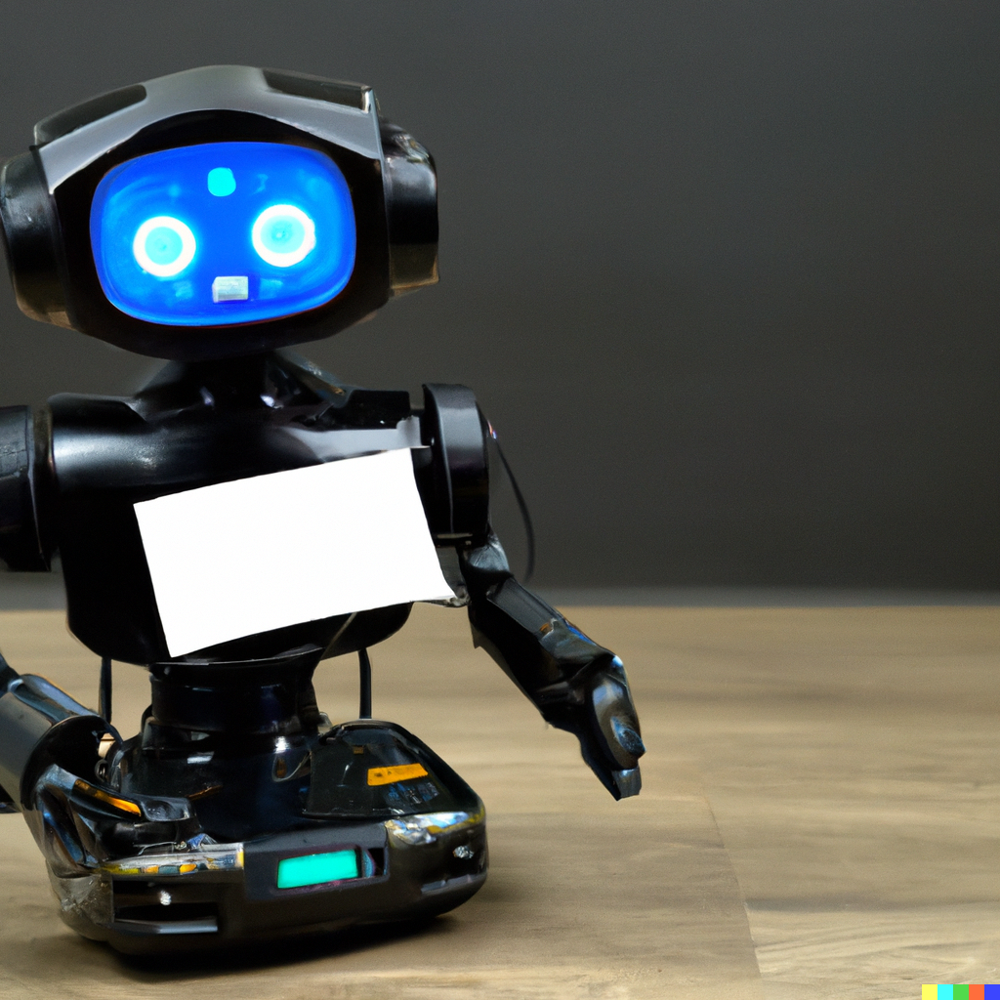

# Meet Our New Tech-Support Guy: Fine-Tuned ChatGPT-4 with External Long-Term Memory
_April 24, 2023_

Table of contents:
* What are We Doing & Why are We Doing It?
* How are We Doing It?
  * Fine-Tuning ChatGPT-4 for Domain-Specific Knowledge
  * Implementing External Long-Term Memory with Vector Databases
  * Creating a Short Term Memory by Querying the Vector Database
* Benefits of AI as Our Support Guy
* Is this AGI in any Form?
* Conclusion

DALL·E 2 Generated ChatGPT powered chat robot:



## What are We Doing & Why are We Doing It?
Customer support has always been a crucial aspect of any successful business, and as technology progresses, so do the solutions available for providing efficient and effective customer service. Our company has recently welcomed a new member to our tech-support team: a fine-tuned ChatGPT-4 model with an external long-term memory system. We are fine-tuning the GPT-4 model with our past interactions, by labeling every question, accepted answer, and intermediate discussion. We are more or less turning all our support tickets into a StackOverflow format. Furthermore, we are using a vector database filled with our product documents as the GPT-4 model's very first memories. Later on, we are maintaining a per-customer vector database to preserve past discussion contexts. In this article, we will introduce you to this groundbreaking AI-powered chatbot and discuss the benefits it brings to our customer support infrastructure.

A visual representation of event sequence for the support bot:

```ascii
+---------------------+
|      Customer       |
+---------------------+
           |
           v
+---------------------+
|  Query Vector DB    |<----------+
| (Long-Term Memory)  |           |
+---------------------+           |
           |                      |
           v                      |
+---------------------+           |
|Semantically Related |           |
|   Context Data      |           |
+---------------------+           |
           |                      |
           v                      |
+---------------------+           |
| Fine-Tuned ChatGPT-4|           |
| (Domain-Specific)   |           |
+---------------------+           |
           |                      |
           v                      |
+---------------------+           |
|   Chatbot Response  |----------+
+---------------------+
           |
           v
+---------------------+
|      Customer       |
+---------------------+
```

## How are We Doing It?
As I mentioned, our support system has two main components: fine-tuning for domain-specific knowledge (patterns) and a long-term memory (context). Later on, we receive embeddings that are semantically closest to the customer's question and send it to GPT-4 for processing. We could say this is the short-term memory part. I must note that we use the `gpt-4-32k` model, which has 32K tokens per request to work with. That's a lot of memory.

### Fine-Tuning ChatGPT-4 for Domain-Specific Knowledge
OpenAI's ChatGPT-4 is an advanced language model capable of understanding and generating contextually relevant and human-like text. However, out-of-the-box models may lack specific knowledge related to a company's domain or unique processes. To overcome this limitation, we have fine-tuned the ChatGPT-4 model using our existing customer support interactions data, such as emails, GitHub issues, and other communication records.

Fine-tuning involves adapting the pre-trained model to a specific task by continuing the training process on a smaller, domain-specific dataset. As OpenAI states, "fine-tuning can help the model acquire domain-specific knowledge and learn the specific terminology, processes, and problem-solving strategies unique to your company" (OpenAI, 2021). By doing so, our AI-powered tech-support chatbot can provide accurate and relevant assistance to customers, ensuring that their needs are addressed promptly and effectively.

### Implementing External Long-Term Memory with Vector Databases
One limitation of ChatGPT-4 is its inability to maintain a built-in long-term memory for recalling specific interactions with users. To provide a more personalized and context-aware customer support experience, we have implemented an external long-term memory system using a vector database.

A vector database is a specialized storage system designed for efficiently storing and querying high-dimensional vector data. In our case, we use it to store conversation history and contextual information from past interactions. When a customer engages with the chatbot, the system retrieves relevant information from the vector database, allowing the chatbot to maintain context and deliver coherent, personalized responses based on the conversation history.

As OpenAI suggests, "using an external memory system to store and retrieve specific contextual information from past interactions" can enhance the performance of AI-powered chatbots (OpenAI, 2021). By combining the fine-tuned ChatGPT-4 model with an external long-term memory system, we can provide a seamless and efficient customer support experience.

### Creating a Short Term Memory by Querying the Vector Database
The long-term memory vector database starts with several GB worth of data in it since we feed our entire product document collection (including all versions) as the very first memories. However, the model we use, gpt-4-32k, can only "remember" 32K tokens, which is only about ~8,000 to ~11,000 words. So based on the user input, we query the vector database, and it gives us sections of our documentation and past conversations that are semantically most related. After that, we feed the user input along with the relevant context, up to 32K tokens, to the GPT-4 model and provide the user with the response. When a single conversation goes on for too long, it exhausts the tokens available for context. As a solution, we split the token count as 16K (for current conversation history) + 16K (query result from the database).

## Benefits of AI as Our Support Guy
Our new tech-support guy, the fine-tuned ChatGPT-4 model with an external long-term memory system, brings numerous benefits to our customer support infrastructure:
* Cost-efficiency: Automating customer support reduces operational costs associated with maintaining a dedicated support team.
* 24/7 availability: The chatbot can handle customer inquiries around the clock, ensuring uninterrupted support whenever our customers need it.
* Faster response times: The AI-powered chatbot can process and respond to customer inquiries quickly, resulting in reduced wait times and improved customer satisfaction.
* Scalability: As our customer base grows, the chatbot can easily handle increased support requests without the need for additional resources.

## Is this AGI in any Form?
Short answer is, no it is not. Artificial General Intelligence (AGI) refers to machines or systems with the ability to understand, learn, and perform any intellectual task that a human being can do. Achieving AGI is a complex and challenging goal, and although there is no universally accepted path to its realization, there are several key areas of research and development that are considered important. Some of these areas include:

* Scalable learning algorithms: Developing learning algorithms that can efficiently learn from vast amounts of data, generalize across various tasks, and continually adapt to new information.
* Transfer learning and few-shot learning: Creating models that can effectively transfer knowledge from one domain to another, or learn new tasks with minimal training data.
* Multi-modal learning: Developing models that can process and integrate information from multiple modalities, such as text, images, audio, and video, to form a comprehensive understanding of the world.
* Common sense reasoning: Building systems that can understand and reason about the world using common sense knowledge, which often relies on implicit assumptions and background knowledge that humans take for granted.
* Memory and attention mechanisms: Implementing advanced memory and attention mechanisms that allow models to store, retrieve, and manipulate relevant information efficiently, enabling them to handle complex and long-term dependencies in data.
* Hierarchical and modular architectures: Designing AI systems with hierarchical and modular structures that can decompose problems into smaller, manageable subtasks, and combine the solutions to solve more complex tasks.
* Reinforcement learning and intrinsic motivation: Developing algorithms that enable AI systems to learn from their interactions with the environment, with a focus on intrinsic motivation and curiosity-driven exploration.
* Human-like learning and interaction: Building AI systems that can learn in more human-like ways, such as through imitation, social interaction, and natural language communication.
* Ethics and safety: Ensuring that AGI systems are designed with ethical considerations and safety precautions in mind, to prevent unintended consequences and align their goals with human values.
* Interdisciplinary collaboration: Combining insights and knowledge from various fields, including computer science, neuroscience, cognitive science, psychology, and linguistics, to inform the development of AGI.

Achieving AGI will likely require progress in all of these areas and more, as well as addressing various technical, ethical, and societal challenges. It's essential to have a collaborative approach, with researchers, policymakers, and other stakeholders working together to ensure the safe and responsible development of AGI.

## Conclusion
The integration of a fine-tuned ChatGPT-4 model with an external long-term memory system has revolutionized our customer support processes, leading to cost savings, improved efficiency, and higher levels of customer satisfaction. By embracing this state-of-the-art AI solution, we demonstrate our commitment to leveraging cutting-edge technology to provide the best possible support to our valued customers.
