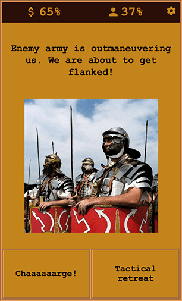

# OBS Studio: Open-Source Software for Video Recording and Live Streaming - Guide
Today I am going to show you how to use OBS Studio to live-stream or record yourself, your screen, or both together. OBS Studio is an open-source software for video recording and live streaming. It has been gaining traction over the years with the rise of live streaming on social media. Gaming focused streaming platforms like YouTube Live and Twitch added fuel to the fire. You can use OBS to stream to pretty much any platform while recording your stream locally. You can even use it as a virtual cam for video conference, for instance, Zoom calls. You can also apply a bunch of filters to your video and audio like noise reduction. I personally use it to record my screen for product demos or to create pre-recorded presentations. When I am preparing to make a webcast, I record my final practice session. If anything happens during the live session, I can at least playback the recorded version.

Table of contents:
* Overview
* OBS Streaming & Recording Demo
* Picture-in-Picture Mode
* Conclusion

## Resources
You can find the video narration of this article on YouTube: [https://www.youtube.com/watch?v=GO9JSW-RqUE](https://www.youtube.com/watch?v=GO9JSW-RqUE){:target="_blank"}{:rel="noopener"}

<iframe width="560" height="315" src="https://www.youtube.com/embed/GO9JSW-RqUE" frameborder="0" allow="accelerometer; autoplay; encrypted-media; gyroscope; picture-in-picture" allowfullscreen></iframe>

Video has live demonstrations. If you want to read the comments or leave a comment, do so under the YouTube video. If you want to contribute to the article, make a pull request on GitHub.

* OBS Studio Home: [https://obsproject.com](https://obsproject.com){:target="_blank"}{:rel="noopener"}
* Source code: [https://github.com/obsproject/obs-studio](https://github.com/obsproject/obs-studio){:target="_blank"}{:rel="noopener"}
* Recent Hacker News discussion on topic: [https://news.ycombinator.com/item?id=22748247](https://news.ycombinator.com/item?id=22748247){:target="_blank"}{:rel="noopener"}

"Crowner": My Android game with "Choose Your Own Adventure" style of text-based gameplay which is used to demonstrate streaming in this guide:
* [https://play.google.com/store/apps/details?id=com.soygul.crowner](https://play.google.com/store/apps/details?id=com.soygul.crowner){:target="_blank"}{:rel="noopener"}

## Overview
I am the QuanticDev, and today I am going to show you how to use OBS Studio to live-stream or record yourself, your screen, or both together. OBS Studio is an open-source software for video recording and live streaming.

It has been gaining traction over the years with the rise of live streaming on social media. Gaming focused streaming platforms like YouTube Live and Twitch added fuel to the fire. You can use OBS to stream to pretty much any platform while recording your stream locally. You can even use it as a virtual cam for video conference, for instance, Zoom calls. You can also apply a bunch of filters to your video and audio like noise reduction. I personally use it to record my screen for product demos or to create pre-recorded presentations. When I am preparing to make a webcast, I record my final practice session. If anything happens during the live session, I can at least playback the recorded version. Now let's jump in and record a simple product demo while streaming it live at the same time! The product in question is my very own "Choose Your Own Adventure" game called Crowner. 

I will stream the gameplay on Twitch.tv while saving it locally to an mp4 file.

## OBS Streaming & Recording Demo

**Note: Live demonstration of the instructions below are on YouTube and the video link is in the resources section on top.**

We will start by opening an Android emulator and OBS Studio window side by side. As you can see, first thing that appears in the OBS window is your desktop. We will continue by adding a new scene using the "+" button on the "Scenes" column which is on the bottom left of the OBS window. Now for this scene, we need a visual source. We will use the "+" button at the bottom of the "Sources" column and select "Window Capture" since we want to capture the Android emulator window and not the entire screen. It takes us to the window selection popup so we can select the Android Emulator window from the dropdown. After hitting OK, we see the Android emulator screen. We can resize and center it as we wish.

Before starting the gameplay stream, we need to do some configuration. Let's click the "Settings" button on the right side of the OBS window. From there, we go to the "Stream" tab and fill in the streaming service we want to use and the required credentials for it. For this example, we will go with Twitch.tv. If you want to change the video quality, you can do so from the "Output" tab. Now let's close the tab and click "Start Streaming" and "Start Recording" buttons. Now we are both recording our stream locally to a file and broadcasting it online.

Let's start the game and check Twitch if we are online yet. And yes, we are broadcasting the Android emulator screen. Everything is set, so now let's go ahead and do some gaming. In Crowner, you are a king, and you need to govern your kingdom. It is text-based and is very simple to play yet has quite a challenging storyline. Your decisions affect the prosperity of your kingdom as well as your popularity as a king. You are bound to strike a balance in your decision-making, or your demise will be tragic. If you want to check it out, the link to the Android version is in the resources section above.

Once our streaming session is done, we can stop streaming and recording and check out the footage. As you can see, our footage looks good and quite clean with no compression artifacts. I used my quad-core MacBook to play, record, and stream at the same time. The CPU usage was about 50% during all of this, as I set OBS to use hardware encoding.

## Picture-in-Picture Mode
One final thing I want to show you is the picture-in-picture mode. If you want to stream a window or your screen plus yourself, you can add another source to the same scene. Go to your Android Emulator scene and hit the "+" button under the Sources column and select "Video Capture Device". That is your webcam by default. After resizing and relocating yourself, enjoy your picture-in-picture stream. You can add more sources to the scene like static images, video files, etc. and create quite advanced scenes.

## Conclusion
You can repeat the same steps and record your PowerPoint window to create a pre-recorded presentation. Or you can record your entire screen to create guides just as I did, and stream it live on YouTube at the same time! I highly recommend setting aside 10 minutes to setup OBS on your computer, as it will fill all your future recording/webcasting needs. It is open-source and free. And if you are a developer, it has bounties like this one that can benefit everyone, and earn you $10,000 while at it!

OBS Studio is open-source at its fines. Use it, share it, donate to it. And while at it, you can give me a sub so I can inform you about my other finest selections from the open-source world. If you know someone that is starting streaming, or a colleague that wants to record presentations, share this article with them to give them a helping hand.