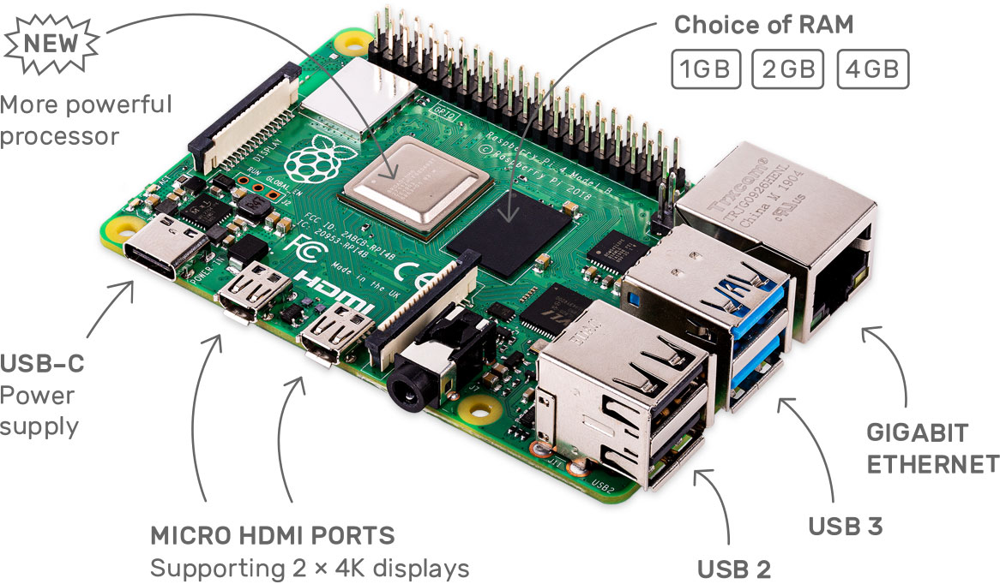
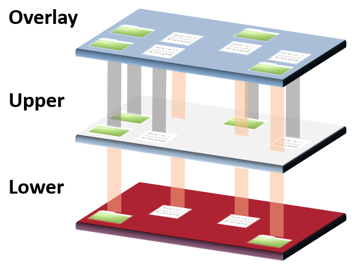
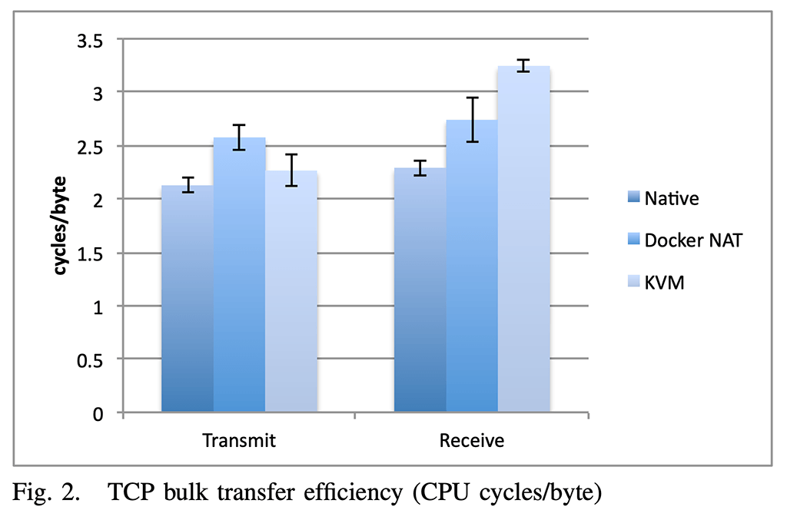
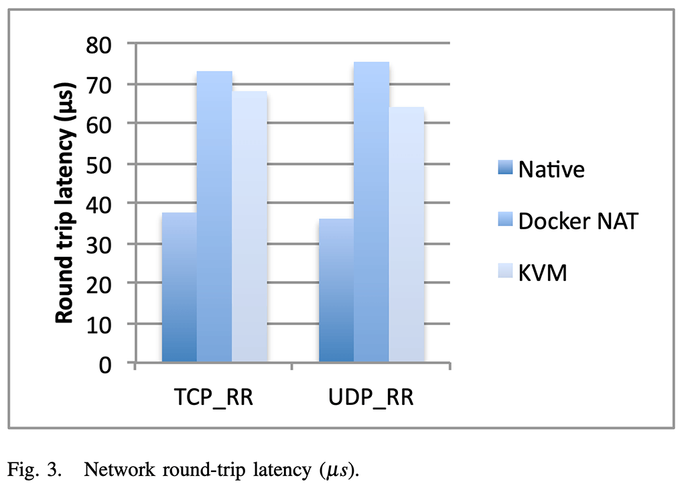

# Raspberry Pi: A Developer’s Companion - Complete Guide with Docker
Raspberry Pi is a very compact and cheap computer (about $35). In this article, I am going to talk about how a developer uses Raspberry and why it is a good companion for you. I will also enlighten you on how Raspberry plays along with Docker and how and why to use them together. My Raspberry needed a fresh install for ages now, so I will do that with you. I will also set up Docker so I can host all my services on it using pre-existing Docker images for Node.js, Golang, MongoDB, Redis, and more.

Table of contents:
* [Resources](#resources)
* [Why Raspberry Pi for Developers](#why-raspberry-pi)
* [Why with Docker](#why-docker)
* [How Do I Use My Raspberry Pi as a Developer?](#how-do-i-use-my-raspberry-pi-as-a-developer)
* [What Else Can You Do with a Raspberry Pi as a Developer?](#what-else-can-you-do-with-a-raspberry-pi-as-a-developer)
* [Raspberry Pi Setup](#raspberry-pi-setup)
* [Docker Setup](#docker-setup)
* [Sample Docker Node.js Application Setup on Raspberry](#sample-docker-nodejs-application-setup-on-raspberry)

## Resources
You can find the video narration of this article on YouTube: [https://www.youtube.com/watch?v=idCG0wSi-fk](https://www.youtube.com/watch?v=idCG0wSi-fk){:target="_blank"}

<iframe width="560" height="315" src="https://www.youtube.com/embed/idCG0wSi-fk" frameborder="0" allow="accelerometer; autoplay; encrypted-media; gyroscope; picture-in-picture" allowfullscreen></iframe>

Video has additional tips for each principle discussed. If you want to read the comments or leave a comment, do so under YouTube video. If you want to contribute to the article, make a pull request on GitHub.

* Get a Raspberry Pi and accessories: [https://www.raspberrypi.org/products](https://www.raspberrypi.org/products){:target="_blank"}
* Download full Raspbian OS that includes recommended software: [https://www.raspberrypi.org/downloads/raspbian](https://www.raspberrypi.org/downloads/raspbian){:target="_blank"}
* Download Etcher (to burn Raspbian ISO image): [https://www.balena.io/etcher](https://www.balena.io/etcher){:target="_blank"}
* Get a microSD and card reader: [https://www.amazon.com/Kingston-Digital-Mobility-MBLY10G2-32GB/dp/B00519BEQO](https://www.amazon.com/Kingston-Digital-Mobility-MBLY10G2-32GB/dp/B00519BEQO){:target="_blank"}
* Enable SSH on first boot: [https://www.raspberrypi.org/documentation/remote-access/ssh](https://www.raspberrypi.org/documentation/remote-access/ssh){:target="_blank"}
* Making Raspberry connect to your WiFi on first boot: [https://www.raspberrypi.org/documentation/configuration/wireless/wireless-cli.md](https://www.raspberrypi.org/documentation/configuration/wireless/wireless-cli.md){:target="_blank"}

My JS-API project used as demonstration in the article:
* [https://github.com/soygul/js-api](https://github.com/soygul/js-api){:target="_blank"}
* [https://www.npmjs.com/package/js-api](https://www.npmjs.com/package/js-api){:target="_blank"}

Great uses of Raspberry Pi:
* [https://news.ycombinator.com/item?id=20264911](https://news.ycombinator.com/item?id=20264911){:target="_blank"}

Most popular Docker images that you can use on your Raspberry:
* [https://hub.docker.com/search?q=&type=image](https://hub.docker.com/search?q=&type=image){:target="_blank"}

## Why Raspberry Pi
Raspberry Pi is a very compact and cheap computer. The new Raspberry Pi 4 with 1GB of RAM costs only $35. I have it on my desk at work, and here it is how it sits.


I have all my charging cables attached to the USB ports. I charge my phones, my headphones, my powerbank, and it all works great since I have the Raspberry attached to a 3A charger. More than its physical usefulness, you want it as a computer. It has a powerful CPU and adequate amounts of RAM for many computing tasks. However, it is especially useful for experimenting, learning, and home-server type of workloads. I will talk more about this in a moment.



## Why Docker
Docker helps you containerize apps. Why do you want containerized apps? Primarily due to ease of use. You can define all their dependencies in a single Dockerfile, they do not pollute your computer with their files, and they work in isolation for security purposes. When you mess up an app container, you can trash it and create a new one in seconds. Since Docker uses OverlayFS, you can even go back in disk history, just like snapshots in a virtual machine.



For instance, say you want to host your own website on your Raspberry. Say you need Node.js and MongoDB for it. All you have to do is to install Docker on your Raspberry and pull Node and Mongo images. After you set up your containers, you can start hosting your website. It is a very good learning experience for Docker, and it will help you dig deeper into the Linux ecosystem.

For those who are worried, performance is pretty good since Docker is not virtualization, it still uses the kernel primitives directly. As you can see in the charts, both CPU and network overhead of Docker are negligible.





## How Do I Use My Raspberry Pi as a Developer?
My use case for Raspberry Pi is exactly as I describe	d up to this point. I host small internal services in Docker containers at home and at work. Most of them are for experimenting and just messing around. Some of them are for small tasks like FTP server for my external drive and periodically recording the home temperature. I also use it as the staging server for most of my web projects. I use a laptop, so it is not always on, but my Raspberry is. Some of the long-running automated tests for those web services require them to be running for 24 hours straight, so I just deploy them to container in Raspberry and run on it.

## What Else Can You Do with a Raspberry Pi as a Developer?
* You can attach a monitor with speakers and use it as a media server with Kodi or Plex.
* You can set up a VPN between your laptop and home network so you can access your home storage remotely. However, this requires careful setup for security.
* You can attach a wireless keyboard with a built-in trackpad and have it ready as a backup computer, just in case. Most developer tools have ARM versions, but you will definitely have some hiccups on the way.
* I have Hacker News link in the resources section that lists some creatives uses for Raspberry, like using it as a programmable public billboard.
* I will also put a link in the description listing the most popular Docker Hub images that you can use with your Raspberry.

## Raspberry Pi Setup
Following are the step-by-step instructions for setting up a new Raspberry Pi starting from scratch. If you do not already have them, you can get a Raspberry Pi, a charger, a microSD, and reader, and Raspbian ISO using the links in the resources section.

If you want, you can watch the video version of this article (on top) to watch me do this live.

* Download Raspbian ISO.
* Insert microSD with the card reader into your computer.
* Download Etcher.
* Start Etcher and follow the instructions to burn the ISO image to the microSD card. 
* After ISO verification is complete, unplug and re-plug the microSD card reader to the computer and browse to the microSD card directory.
* Create a blank file called "ssh" with no extension. This will enable the SSH server on your Raspberry on the first boot so we can connect to it remotely.
* Create a file called "wpa_supplicant.conf" with the contents provided below. Adjust lines according to your WiFi settings. This file will make your Raspberry connect to your wireless network on first boot so you will not have to use an ethernet cable. You can find more info on this in the resources section.
   ```
   ctrl_interface=DIR=/var/run/wpa_supplicant GROUP=netdev
   update_config=1
   country=US
   network={
      ssid="My Home WiFi Name"
      psk="mypassword"
   }
   network={
      ssid="Work WiFi Name"
      psk="workwifipassword"
   }
   ```
* Drag the "wpa_supplicant.conf" and "ssh" files to the "root" directory in your microSD.
* Eject the microSD card.
* Plug microSD to Raspberry and connect it to the charger.
* It will automatically connect to your pre-configured WiFi. If it does not work, you can plug it to your network with an ethernet cable. Alternatively, just attach a monitor and a keyboard.
* Connect to your Raspberry with SSH using the following command on your terminal:
  * `ssh pi@raspberrypi.local # default pass: raspberry`
* Start Raspberry configurator with the following command:
  * `sudo raspi-config`
* Start by changing your password.
* You can optionally change your network hostname from the "Network Options" menu to something unique if you are going to have multiple Raspberries in your network.
* Go to the "Interfacing Options" menu and enable VNC so you can remotely see your Raspberry's desktop when you need to. We have already enabled SSH with the "ssh" file trick during boot.
* Optionally to go "Advanced Options" and change your desktop resolution to 1024x768 or higher.
* Select the "Finish" option at the bottom and let your Raspberry restart.
* Optionally you can test your VNC connectivity to your Raspberry using RealVNC or any VNC client. Put in following settings in new VNC connection dialog:
  * VNC Server: raspberrypi.local (or if you changed the network hostname, use that name instead)
  * Username: pi
  * Password: raspberry (if you changed it, use the new password instead)
* After successfully connecting to your Raspberry through VNC, you will see the first-time configuration wizard. Follow the dialogs to set your localization, time zone, etc. Then you can go to the start menu and open some apps to see if everything is working.

## Docker Setup
Now it is time to setup Docker. You can also watch the video version of the article to see the live demonstration of me doing this on a Raspberry Pi.

* Start by SSH-ing into your Raspberry using the following command from your terminal:
  * `ssh pi@raspberrypi.local # default pass: raspberry`
  * #use password 'raspberry' if you did not change it
* Always update your Raspberry before installing new packages. Use the following commands. If you have a lot of packages to be updated, this can take a while.
  * `sudo apt update`
  * `sudo apt full-upgrade`
  * `sudo reboot`
* After your Raspberry reboots, connect to it with SSH as instructed above. Now install Docker using the installer script. It is the officially recommended way of installing Docker on Raspberry, but remember to inspect to script before executing it.
  * `curl -fsSL https://get.docker.com -o get-docker.sh`
  * #see if there is anything nasty
  * `cat get-docker.sh`
  * `sudo sh get-docker.sh`
  * #add user 'pi' to group 'docker' so you can type Docker commands without sudo
  * `sudo usermod -aG docker pi`
  * `sudo reboot`

Let your Raspberry reboot and reconnect to it using SSH again.

## Sample Docker Node.js Application Setup on Raspberry
Now you have your Raspberry and Docker all set up; you can start being productive with it. We will start by creating a Docker container with a sample web app. For this purpose, we will use JS-API, my open-source project, for easily creating JSON API servers with Node.js. The project is hosted on GitHub and NPM, and the links are in the resources section.

See the video if you want to watch me do this exercise for you.

* Now let us install my JS-API npm package so we can start an API server inside a Docker container in our Raspberry:
  * #start a Docker container in interactive mode and expose port 3000
  * `docker run -it -p 3000:3000 node bash`
  * #docker run step will pull the Node.js Docker image so it can take a while depending on your internet connection speed.
  * `npm install js-api`
  * `cd node_modules/js-api`
  * `npm start`
  * #js-api will run some integrations tests so you should see the output on the console
* Now switch from your terminal app to a browser app (Chrome, Firefox, etc. are all fine). Go to the following URL:
  * http://raspberrypi.local:3000/posts
  * If you changed the network hostname, use that instead of "raspberrypi".
  * You should see a JSON object listing all posts in the js-api's in-memory database.
  * Change the /posts URL to /local-users, and you should see the local users list.

And that is it. You now have a sample Node.js web app running inside a Docker container in your Raspberry. If you want to experiment, you can find more useful Docker images on Docker Hub using the link in the resources section.

I highly recommend getting a Raspberry to any developer just based on the sheer usefulness of it. You pay a tiny fraction of the price of a computer, and even just the learning experience you get out of it is a huge value. One day, we will be able to use ARM as our primary development platform, and on that day Raspberry like tiny computers will be our primary workstations. Until that day, hold on to your Raspberry. And I will see you next time.
