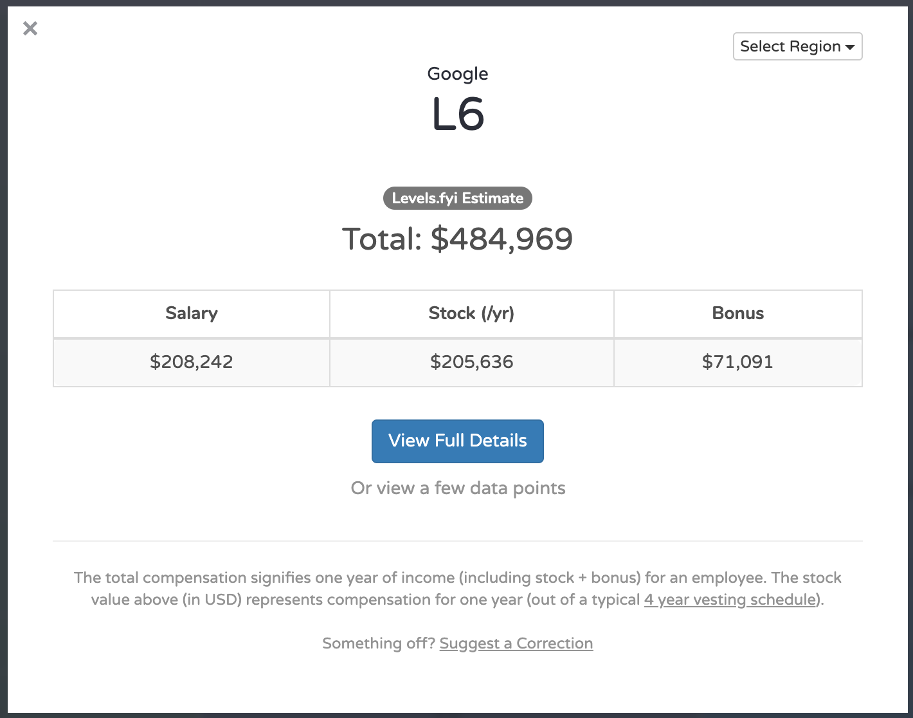

# Software Engineer Compensation Guide - From Junior ($100K) to Senior ($500K++) Engineer Compensations
Today I am going to talk to you about the titanic pay gap between junior and senior engineers. I will mainly focus on software engineering, but it applies to engineering in general. I will also give you some tips on how much you should expect to be compensated and how you can compare yourself to others.

As an example, a junior engineer fresh out of college even with an unrelated diploma like physics, math, or industrial engineering can score a $100K compensation in Silicon Valley, while a senior engineer with a successful decade long career will get $500K and upwards. What are the reasons for this huge gap? Is it only years? Let us investigate.

## Resources
You can find the video narration of this article on YouTube: [https://www.youtube.com/watch?v=4q1GGW04hjw](https://www.youtube.com/watch?v=4q1GGW04hjw){:target="_blank"}{:rel="noopener"}

<iframe width="560" height="315" src="https://www.youtube.com/embed/4q1GGW04hjw" frameborder="0" allow="accelerometer; autoplay; encrypted-media; gyroscope; picture-in-picture" allowfullscreen></iframe>

Video has additional tips and illustrations. If you want to read the comments or leave a comment, do so under the YouTube video. If you want to contribute to the article, make a pull request on GitHub.

Salary and compensation comparison resources:
* Levels.fyi: [https://www.levels.fyi](https://www.levels.fyi){:target="_blank"}{:rel="noopener"}
* PayScale: [https://www.payscale.com](https://www.payscale.com){:target="_blank"}{:rel="noopener"}
* LinkedIn Salary: [https://www.linkedin.com/salary](https://www.linkedin.com/salary){:target="_blank"}{:rel="noopener"}
* GlassDoor Salaries: [https://www.glassdoor.com/salaries](https://www.glassdoor.com/salaries){:target="_blank"}{:rel="noopener"}

Learn to negotiate your salary from real recruiters:
* Moonchaser.io: [https://www.levels.fyi](https://www.moonchaser.io/?utm_source=quanticdev&utm_medium=article){:target="_blank"}{:rel="noopener"}

Do not forget, before assuming your compensation based on resources above, compare your projects, publications, references, and accomplishments to others. The article will guide you on all these points.

I will create a dedicated in-depth article to help you estimate your expected income later on. It will include software and other fields of engineering, and perhaps some of engineering management field.

## How Much Do Engineers Get Paid?
First things first, how much do engineers get paid. Let me show you some data from levels.fyi:

The first thing to note is that charts display the total compensation, which includes salary, bonus, and stock options. As you can see, the pay scale gets progressively higher. When you reach the higher mid-tier, you stand at around half a million dollars. Top tiers are reserved for specialized positions, and your income will be almost entirely stock options and bonuses and will be open-ended. Check out the resources section above to get a list of websites that host up-to-date compensation charts for many positions in different companies.

Let us say you are a software engineer with 10+ years of experience and a great portfolio of projects, publications, a provable record of accomplishments, and good references. If you want to work for a Silicon Valley company in an engineering position, you should expect to be compensated $500K on average, as you just saw on the charts.
* Do not forget, before assuming your compensation based on resources above, compare your projects, publications, references, and accomplishments to others.
* Also, do not forget to factor in the location. It will make a huge difference as the cost of living varies massively, especially if you have a family.
* If you successfully continue to execute, you can expect to get significant increases in your compensation based on internal and external opportunities.
* Tip: As you can see in the comparison sites, compensation in Silicon Valley is roughly double that of everywhere else. The primary reason for this is the people living in it, and their competitive edge. So, what makes them so competitive, you will learn throughout this article.

## Why are Senior Engineers Getting Paid More?
Now let us start by exploring the reasons why seniors cost a lot. Remember, not everyone will have all these traits that I mention, but each one of them helps.

* First off and most importantly, successful senior engineers are more competitive.
  * Having a competitive mindset, along with appropriate experience and skillset, will eventually get you what you want. Competitive people persist until they reach success. Be it creating a product, or going to 100+ interviews to get the compensation that they ask for.
  * Tip: You need to believe that you are worth a certain amount and be ready to turn down any offer under that. To get your worth, you might have to do 100 interviews. While doing interviews, also do networking through your connections, join conferences to build those connections, be on social media, make blog posts, create publications, and get involved in open-source. These are all bonus points, and will help you connect with more people.
* Seniors engineers have leverage.
  * Seniors generally have multiple sources of income; side businesses, investments, real estate, stakes in other ventures, etc. Being economically independent is a huge leverage.
  * Working for less than what you are already making from your ventures does not make economic sense. During your interviews, you can clearly signal the HR people that you will not accept anything under a certain amount since it does not make sense for you.
  * The key is to not need to money (or at least give the impression of), so you can negotiate from a non-needy perspective. Also, remember when HR people manage to hire you for cheap, they get a bonus for that. So, they will try to drag you down if they sense that you cannot say no to any offer they make.
  * Tip: List your projects and the revenue that they generate on your CV. This will give a powerful message on your financial expectations while applying for a job.
* Seniors have much more to show.
  * They have many personal, corporate, and open-source projects to demonstrate.
  * They have personal connections and references to vouch for them.
  * Having a recognized portfolio of publications helps a lot.
  * Also, having other industry recognitions like awards, fellowships, etc. will help monumentally.
  * Tip: All these things make your hand stronger so you can be better at negotiations. However, presenting your achievements appropriately is of utmost importance. I will have a separate article on how to present yourself and your achievements in the future.
* Senior people tend to have better product sense.
  * Thinking with an engineering sense is good enough, and not everyone is a product person. But at least some people develop product sense over time and even move on to product management.
  * Being involved in full product development cycle many times helps you better understand what customers might need or want.
  * Tip: I will also make a article on product development in the tech field. Watch out for it.
* Seniors are conscious of their worth and the current market.
  * Being in the industry for a long time makes you aware of the market and supply/demand situations.
  * Constant networking and communicating keep you up-to-date on your standing against your competitors in the field.
  * And finally, the more senior you get, the keener you become on the business aspect of engineering. Being closer to the money, and being interested in money, enables you to chase it better.
* Seniors engineers are conscious of their productivity and the value that they generate.
  * They are also conscious of the fact that the value that they generate in a company stays in that company. So, they ask to be compensated accordingly.
  * Many companies choose to compensate seniors, mostly with stocks and stock options. This is to ensure that they get some of the value back. This also gives them liability and a direct influence on the outcome of their projects and their compensation. It is also generally cheaper for companies to hand out shares instead of cash.
* Seniors are generally better at sharing information, presenting ideas, and mentoring juniors.
  * Any new brain you mentor is a huge value for the company that you work for. You might be gone one day, but the others you trained will carry on.
  * Passing ideas and information down the line will help everyone, which is also a huge value add for the business.
* Experience counts.
  * Seniors can get the same thing done in much less time. Here is why:
    * If they did a task like the one in hand a million times before, they will easily reapply the knowledge, and adapt if necessary. Personally, as a senior myself, I am having a much better time compared to my junior years. Literally, everything gets easier the senior you become.
    * If they need to research and learn, their previous experiences will make it far easier for them.
  * And they are more likely to deliver results.
    * Having failed a lot is an immense experience and is a facilitator to success. How do I know? Because of my failures.
    * Having completed and scaled many projects is also an immense facilitator to success. Again, how do I know? From my personal achievements in the field.
  * Tip: Here is a personal anecdote. On a project that I have worked on, our juniors struggled for about a month to create multiple instances of one of our .NET/C# services in a memory-constrained environment. Since .NET/C# combo is not commonly used in scalable systems, they could not find many resources online. Then I came in, educated them on .NET application domains and strategies of sharing runtime resources and memory, and wrapped up the project in about two days. This is the kind of difference that experience can make, especially in niches like this one.
* Seniors generally have some form of management experience.
  * A decent percentage of them will have some team leadership experience.
  * They will play a role in hiring people to offload workload and be more productive.
  * They will take initiatives and will not wait until a product manager makes decisions for them. They will know how to play ball with the management.
  * And again, they will help mentor other people, even their fellow seniors! This, as I said, adds huge value to the company.
  * Tip: In many tech companies, engineers can make more money than their managers. Silicon Valley companies have been offering ways of vast compensation increases without switching over to management tracks. Since not everyone has the desire to be a manager, it is important not to lose tech talent that contributes to technical things significantly.
* Accountability.
  * Senior engineers are held accountable for the success or failure of their projects. If they are team leads, they are also held accountable for the success and failure of their team. This generally does not apply to juniors, and any failure is just recorded as a learning experience.
* Game of diminishing returns applies to engineering also. As people grow, their expectations also grow. However, taxes and other new expenses like kids, hold them back. As a result, seniors seek higher returns on their time investment in any business.

## Why Do Juniors Engineers Get Paid Less?
Now let us explore why juniors get paid less. I will not go into much detail, but here are the top points based on my experiences from my junior years:
* Most senior and junior interactions are mostly based on mentorship. Juniors tend to bombard seniors with questions on tech and tooling related topics, which takes a huge chunk of time from seniors. As a result, effective cost of employing juniors ends up being much higher.
* Juniors generally concentrate only on technology and not on the product aspect of things. This is probably the right thing to do if you do not intend to become a product person. Technology experts have their place in the market, and they are still generously paid.
* Juniors generally act on opportunities presented to them, rather than creating the opportunities. This is again acceptable since if you do not know the market, you can end up making terrible decisions in the name of chasing what you see as an opportunity. For instance, I have witnessed a ton of juniors resigning from their promising posts in larger tech companies, to pursue positions in startups, in a game of blind luck. They blissfully neglect the opportunity cost of leaving their big tech career behind while doing their math.

When it comes to seeking higher returns on your time investment in your career, always stay calm and collected. Be it during networking, job interviews, etc. If you cannot get what you expect, keep trying. If you get more than what you expect, play it cool. It is all about that "blue steel baby, blue steel."
