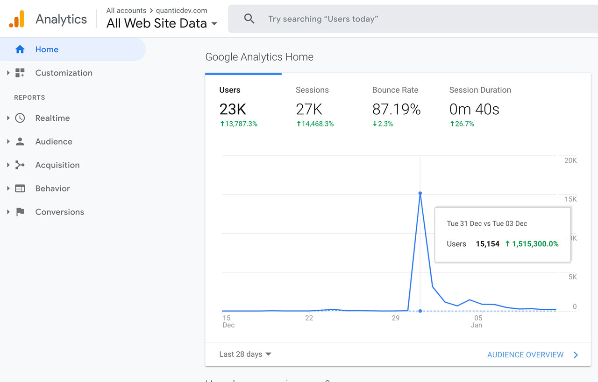

# How to Set up a Free Website with GitHub Pages - How I Created quanticdev.com
I have recently published quanticdev.com using only GitHub Pages and markdown and decided to create a guide to preserve this knowledge in the form of an article so I can reuse it in my future projects. GitHub Pages is a free and a pretty good hosting service. It is an add-on for regular GitHub repositories, and you can host your website as well as code and other things in one repo, which is pretty good. I must warn that GitHub Pages is intended for techies. If you want something much simpler, go with Google Sites, or Blogger.com, or WordPress. In the first part of this article, I will discuss the strengths and weaknesses of GitHub Pages. In the second part, I will deploy a brand-new website using GitHub Pages and simple markdown. Everything will be done through GitHub's UI and online code editor. I will also demonstrate a sample React website hosted on GitHub Pages.

Table of contents:
* QuanticDev.com Intro
* Why GitHub Pages
* Advantages
* Disadvantages
* GitHub Pages Setup & How I Created quanticdev.com
* My Recommendations
* Conclusion

## Resources
You can find the video narration of this article on YouTube: [https://www.youtube.com/watch?v=jPhmR3TiGq8](https://www.youtube.com/watch?v=jPhmR3TiGq8){:target="_blank"}

<iframe width="560" height="315" src="https://www.youtube.com/embed/jPhmR3TiGq8" frameborder="0" allow="accelerometer; autoplay; encrypted-media; gyroscope; picture-in-picture" allowfullscreen></iframe>

Video has additional tips for each principle discussed. If you want to read the comments or leave a comment, do so under YouTube video. If you want to contribute to the article, make a pull request on GitHub.

Free website hosting:
* GitHub Pages (for techies): [https://pages.github.com](https://pages.github.com){:target="_blank"}
  * Supports Jekyll: [https://jekyllrb.com](https://jekyllrb.com){:target="_blank"}
  * Supports Static HTML + CSS + JavaScript
  * Supports React (and anything that compiles to static HTML/JS/CSS): [https://create-react-app.dev/docs/deployment/#github-pages](https://create-react-app.dev/docs/deployment/#github-pages){:target="_blank"}
* Google Sites (non-techies): [https://sites.google.com](https://sites.google.com){:target="_blank"}
* Alternatives for Bloggers
  * Blogger (basic): [https://blogger.com](https://blogger.com){:target="_blank"}
  * WordPress (more advanced): [https://wordpress.com](https://wordpress.com){:target="_blank"}
* Alternatives for Programmers
  * Heroku: [https://www.heroku.com](https://www.heroku.com){:target="_blank"}
  * Firebase: [https://firebase.google.com](https://firebase.google.com){:target="_blank"}

## QuanticDev.com Intro
I host quanticdev.com on GitHub Pages, and here is how it is looking right now on mobile.

After I published, I made over a hundred changes to the website and every time it got deployed with no problems. I have the source code of the website along with the articles on a public repository on GitHub. 

All the articles are written in markdown so people can easily contribute to it. You can even edit the articles directly on GitHub's UI.

Currently, quanticdev.com has a small number of regular visitors, and it has been working a treat. Recently, [one of my articles](https://news.ycombinator.com/item?id=21913129){:target="_blank"} reached the front page of Hacker News and the traffic to my website exploded.

Even then, I had no hiccups, and GitHub served my website with no problems or slowdowns.

I have also been hosting my personal website, [soygul.com](https://soygul.com){:target="_blank"} on GitHub pages for several years now, and it has also been working perfectly. I have [all my posts as simple static HTML pages](https://github.com/soygul/soygul.com){:target="_blank"} and had no problems with it up to this point.

## Why GitHub Pages
Most tech people already use GitHub in one way or another. Open-source software, hardware schematics, etc., a lot is hosted on GitHub. If you are already using GitHub, you can set up your website without needing to learn any new tools. If you were to use another host, you would have to learn their tools and way of doing things which would introduce complexity to your workflow. Now let us check out the advantages, disadvantages, and alternatives to GitHub Pages.

## Advantages
* Easy Setup and Free: Setting up a new website with GitHub pages will take you 10 minutes for the first time and just several minutes for your next website. It is very easy to set up, and configuration is simple and well crafted. Bonus: it is free! Though, do not abuse it via hosting large files with no content. You can use GitHub Releases to host files, which is made for that purpose and is still free.
* GitHub Integration: As I mentioned, GitHub Pages is a part of GitHub so it integrates nicely with the GitHub ecosystem. When you log in to your GitHub account to push some code, you already have access to all your websites along with it.
* Automatic Deployment: When you commit some code to your repo or change a file through GitHub's UI, your site is redeployed automatically within seconds. After the first setup, you do not need to do anything else.
* GitHub Editor: You do not need to learn Git to edit your pages. You can directly create or edit files on GitHub's code editor. It has great syntax highlighting for HTML and previews for markdowns.
* Pull Requests: Other people can contribute to your website using GitHub Pull Requests. After you merge that Pull Request, your site will be automatically deployed. They will show up at the contributors list, which is good for them, and you will get good contributions in return, which is good for you.
* GitHub Issues: People can report errors in your website simply using GitHub issues. They can also request features or start a discussion. You do not need an external issue tracker.
* Jekyll and Plugin Support: GitHub Pages have built-in support for Jekyll and Jekyll plugins. It is one of the best static site and blog generators, and it has markdown support. It not only has a ton of great features but a ton more great plugins. You can simply enable plugins by adding their name to your site config file at your repo root. I use Jekyll and markdown for quanticdev.com, and it has been fantastic up to this point.
* HTML Support: You can opt to generate your pages by hand using good old HTML, CSS, and JavaScript. I do this for [my personal website](https://github.com/soygul/soygul.com){:target="_blank"}, and it has been working a treat for the last 5 years.
* React Support: You can use any framework, including React, that can compile down to static HTML and JavaScript. If you want to learn how to do it, the link is in the description below. I will demonstrate this in the next section.
* GitHub Actions: If you need to auto-generate custom RSS files or need to do other chores every time you make a change to your website, you can automate them using simple GitHub Actions.

## Disadvantages
* Only for Static Websites: GitHub Pages is only meant for static websites, and it does not support PHP, Python, or any other server-side framework. If you need to access a database, you will have to publish the server-side of your app on a dynamic hosting provider like Heroku, Firebase, etc. which adds major complexity. In summary, if you need server-side processing, GitHub Pages is not for you.
* Comments Plugin: If you want comments under your pages or posts, you will have to use special plugins that convert each comment into a GitHub Pull Request, so you can review and publish them. This way, comments are stored right in the static page itself, which is pretty good. However, people will have to have a GitHub account to be able to comment. It will also result in hundreds of pull requests per day if you have a major discussion going on.
* Jekyll is Limited: If you choose to go with Jekyll, you will soon realize that it is meant for simple-ish websites and blogs. It has very basic page routing support, very primitive RSS plugin, etc. However, you can use other frameworks like React, which can compile down to static HTML + JS so you can get around these limitations. But this adds complexity again.
* Trailing Slashes: GitHub Pages add trailing slashes to your pages if they are directories. Say if you have `articles/my-article/README.md` or `articles/my-article/index.html`, they will be served with URL: `articles/my-article/` with the trailing slash. I really do not like trailing slashes but appears to be how GitHub Pages servers are configured. According to my research, there is no way to get rid of trailing slashes at the moment.
* 100 MB Limit: You cannot upload files bigger than 100 MB to GitHub. You might also get throttled if you are eating up a ton of bandwidth. However, you should already use a content delivery network (CDN) if you want to host big files or videos anyway.
* GitHub Terms and Conditions: You are bound by the GitHub terms and conditions if you are hosting on GitHub Pages. No illegal files, GitHub can terminate your account with no reason, etc. You know, the usual.

## Alternatives
* Google Sites: For non-techies, Google Sites is my go-to advice. It is free and very easy to use. It has templates and themes that are fit for many purposes. Also, there is no coding involved. You can drag and drop boxes around to change the layout of your pages. You can drag and drop images and other files to add them to your pages, and you can import text from Google Docs or just type it.
* Blogger.com and WordPress.com: If you want to create a blog rather than a regular website, these two fit you better. They are specialized for blogs and have many plugins to help you if you are a regular blogger. But if you do not do blogging frequently, added complexity is not worth it. Note that these both have free and paid versions.
* Heroku and Firebase: Both of these are meant for developers and will require coding. In return, you will get the ability to access a database and other services via deploying server-side apps. They all have generous free tiers for personal and basic business needs.

## GitHub Pages Setup & How I Created quanticdev.com
Now that we know what GitHub Pages is and what is it not, let us go ahead and deploy our first site on it from scratch.
* If you do not have one, start by registering an account with GitHub.
* Continue by creating a new project for your website. Do not forget the check the checkbox that says "Initialize this repository with a README". If you do not do that, you will not be able to edit your website through GitHub's UI.
* If you want, select a license while creating a project. If you do not select a license, it means you reserve all rights to your work.
* Once your project is created, click on the little pen icon on the right side of your README to start editing your website. Edit the title and body of your home page, which is the README.md file, and click the "Commit" button at the bottom.
* After you are done, click the "Settings" button at the top of your GitHub repository. Scroll to the "GitHub Pages" section and click the "Sources" button and select "master" branch as the source code of your website. After that, scroll back to the same section to see the full URL of your newly published website. Click on it to visit your brand-new website.
* Optionally, you can select a theme for your website. You can skip this is you are planning to keep your website simple or plan to add your own styling later.
* Optionally you can assign a custom domain name to your website. Follow the instructions provided in the GitHub Pages documentation if you plan to do this. The documentation link is in the resources section.
* Optionally, copy your website's URL to your GitHub repo description so you can easily access it.
* You can add new pages to your website using the "Create new file" button at the home of your GitHub repository. You can create directories through that UI by simply typing forward-slash into the file name field after typing the directory name. I recommend always nesting your new pages in new directories so your links will work both in GitHub UI and on your domain. As an example, create the following as your new page: "another-page/README.md". If your file name is "README", it will be rendered by default in GitHub UI.
* You can link to your new page using simple markdown syntax like this: [another-page](another-page). HTML equivalent of that would be just a relative link with URL: "another-page".
* I will not go into the details of deployment of React apps to GitHub Pages. But to verify that it can be done, I did it and here is how it looks:

If you want more information on React + GitHub Pages, documentation link is in the description below.

## My Recommendations
Try to use plain HTML if possible. Markdown is also a good option, but it also adds complexity as markdown pages will be rendered through Jekyll. React and other statically compliable frameworks will give you the most flexibility, yet they are most maintenance intensive. If you are not a developer, simply use Google Sites, Blogger.com, or WordPress.com.

## Conclusion
In conclusion, GitHub Pages is an amazing and free tool for developers and technical people who want to put up static websites with minimal work. If you need anything else, it has good alternatives too. As always, write down your requirements before you begin any new website project and see if your hosting provider satisfies them. If GitHub Pages satisfy your requirements, it is great, and I highly recommend it.
